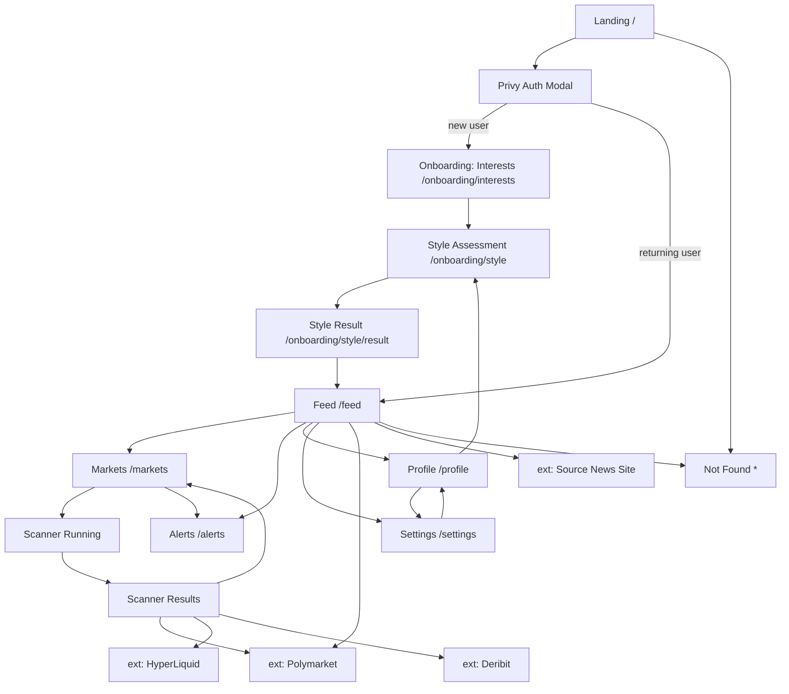

# PRD: Capacitr — Market Discovery Terminal (v4.0.2)

## 1. Executive Summary

Capacitr is a market discovery terminal that turns any real-world signal — a news article URL, a tweet, a topic, a question, or an opinion — into a ranked list of tradeable markets across three categories: **prediction markets (Polymarket)**, **perpetual futures (HyperLiquid)**, and **options (Deribit)**. The product solves the "signal-to-position" gap: information that drives trading decisions lives on X, Reddit, news sites, and Farcaster, while the markets that reflect those narratives live on separate exchanges, and nobody connects the two. Capacitr is the connector.

The system runs on two pillars: an on-demand **Scanner Pipeline** that processes a single user input through 11 visible steps in ~10 seconds, and a continuously running **Feed Aggregator Agent** that pre-computes a personalized, cached news-plus-markets feed for each logged-in user every ~3 hours. A **Risk Profile Module** captures the user's investing style (e.g., "Steady"), and an **Alerts System** (MVP surface shown, wiring pending) lets users monitor specific market thresholds. Authentication is social-only via Privy (Twitter + Farcaster). The UI is a distinct orange/dark-green terminal aesthetic ("KINETIC_OS V4.0.2") that intentionally exposes system internals to the user as a product feature, not hides them.

This PRD documents the v4.0.2 system as observed in the live demo at `demo.capacitr.xyz`. It is written at implementation granularity so it can be used directly as input to code-generation tools.

## 2. Problem & Solution

| Pain Point | Solution |
|-----------|----------|
| Traders see a tweet or headline but have to manually search Polymarket, HyperLiquid, and Deribit to find related markets | **Scanner**: paste a URL or type a topic — system extracts entities/keywords and surfaces matching markets across all three venues in one view |
| Users browsing passively don't know which markets are worth watching right now | **Feed Aggregator Agent**: pre-generates a personalized feed every ~3 hours, attaching relevant markets directly under each news story |
| The same narrative (e.g., "Fed rate cut") corresponds to a prediction, a perp, and an options play, but these are never connected | **Cross-referenced narratives**: the pipeline explicitly cross-references results across prediction/perp/option venues in step 9 of the Scanner |
| Prediction markets frequently mispriced vs. true probability | **Quotient Intelligence integration**: AI-computed fair odds overlaid onto Polymarket markets, flagging edge opportunities |
| Users don't know what kind of markets suit them | **Risk Profile Module**: short self-assessment produces a "style" tag (e.g., "Steady") used to tune recommendations |
| Users miss price movements on markets they care about | **Alerts System**: configure price or volume triggers on any market; notifications when triggered |
| Information density of a pro terminal is alien to most users | **Terminal aesthetic as product language**: KINETIC_OS exposes pipeline steps, cache timestamps, and agent status as first-class UI, making the system feel legible and powerful rather than magic |

## 3. Goals & Non-Goals

### Goals (v4.0.2 — current scope)

- Authenticate users via Privy with Twitter or Farcaster social login.
- Let any logged-in user capture their interests across a fixed taxonomy of 10 clusters.
- Let users run ad-hoc scans on any URL or natural-language topic and receive matched markets from Polymarket, HyperLiquid, and Deribit, enriched with Quotient's fair-odds data.
- Render scanner results with a transparent 11-step pipeline log, an entity/keyword summary, and a three-category market breakdown.
- Continuously pre-aggregate a personalized feed of news stories with attached prediction markets, refreshed on a ~3-hour cadence.
- Capture a simple risk/style profile per user and display it on the profile page.
- Provide an Alerts page surface ready for future configuration of price/volume triggers.
- Render a consistent terminal-style UI ("KINETIC_OS") across all authenticated pages with persistent left-nav, status bar, and version indicator.
- Deliver a public landing page that explains the product and funnels to authenticated sign-up.

### Non-Goals (out of v4.0.2)

- Native mobile apps (web-only; responsive but not RN).
- In-app trade execution. All trade buttons link out to the source venue (Polymarket/HyperLiquid/Deribit).
- Email or wallet authentication. Privy is configured to only expose Twitter and Farcaster.
- Alert delivery channels beyond in-app. No email/Telegram/SMS alerts in v4.0.2.
- Multi-workspace or team collaboration. Each user has a single personal workspace.
- User-created custom markets or publishing of scan results.
- Real-time WebSocket price updates on feed cards. Prices are refreshed on server-side cadence.
- Portfolio tracking or P&L.
- Full-text search across historical scans. Each scan is independent.
- Native support for markets beyond Polymarket, HyperLiquid, and Deribit.
- Regulatory compliance work (KYC, geo-blocking, regulated disclosures) beyond a universal disclaimer.

## 4. Feature Requirements

### Authentication & Session
- **FR-AU01 (P0)**: Users can sign up / log in with Twitter via Privy.
- **FR-AU02 (P0)**: Users can sign up / log in with Farcaster via Privy.
- **FR-AU03 (P0)**: On first successful login, the user is routed through an onboarding flow that requires selecting at least 3 interest clusters before the main app is accessible.
- **FR-AU04 (P0)**: Users can log out from the user avatar menu in the header.
- **FR-AU05 (P0)**: Session persists across reloads via Privy-managed token.
- **FR-AU06 (P1)**: Unauthenticated access to any `/app/*` or `/feed`, `/markets`, `/alerts`, `/profile`, `/settings` route redirects to the landing page.

### Interests & Personalization
- **FR-IN01 (P0)**: The system defines exactly 10 interest clusters: Politics, Sports, Crypto, Music, Food, AI, Pop Culture, Tech, Environment, Finance.
- **FR-IN02 (P0)**: Users must maintain a minimum of 3 selected clusters at all times. The Save button is disabled if fewer than 3 are selected.
- **FR-IN03 (P0)**: Selecting/deselecting a cluster is a toggle. Selected clusters render with orange border and a "SELECTED" label with their position number.
- **FR-IN04 (P0)**: Saving interest changes triggers a Feed re-aggregation for the current user and returns the user to the Profile page.
- **FR-IN05 (P1)**: The Edit Interests page displays a running counter ("CURRENT: 03 CLUSTERS ACTIVE").

### Risk / Style Profile
- **FR-RP01 (P0)**: On first login after interest selection, users take a short risk-style assessment.
- **FR-RP02 (P0)**: The assessment outputs one of a fixed set of style tags (v4.0.2 includes at least "Steady"; full taxonomy TBD by product, see §9 data model).
- **FR-RP03 (P0)**: The resulting style tag, a one-line subtitle, and a 2–3 sentence description are displayed on the Profile page under "YOUR STYLE".
- **FR-RP04 (P0)**: Users can retake the assessment at any time via the "RETAKE ASSESSMENT" button.
- **FR-RP05 (P1)**: Retaking overwrites the previous style tag; the previous result is not kept.

### Scanner (Market Scanner V2)
- **FR-SC01 (P0)**: The Markets page accepts a single text input that can be a URL or free-form natural language (topic/question/opinion).
- **FR-SC02 (P0)**: The input area shows 5 type chips — News Articles, Tweets, Topics, Questions, Opinions — which when clicked either pre-fill an example input for that type or hint the backend about input type.
- **FR-SC03 (P0)**: Clicking SCAN triggers the Scanner Pipeline and immediately renders a live-updating 11-step log under the input.
- **FR-SC04 (P0)**: The pipeline executes these 11 steps in order, each visibly logged: (1) Initializing Market Scanner, (2) Fetching Source Content, (3) Parsing HTML / Extracting Text, (4) Running NLP Entity Extraction, (5) Identifying Tickers & Keywords, (6) Querying Polymarket Prediction Markets, (7) Querying HyperLiquid Perpetuals, (8) Querying Deribit Options Chain, (9) Cross-Referencing Narratives, (10) Ranking by Relevance Score, (11) Compiling Results.
- **FR-SC05 (P0)**: On completion, a `SCAN_COMPLETE` panel displays the 2–3 sentence summary, an `ENTITIES` list (green chips), a `KEYWORDS` list (orange chips), and a `MARKETS FOUND` count.
- **FR-SC06 (P0)**: Below the summary panel, three counter tiles display the count of matched Predictions / Perpetuals / Options.
- **FR-SC07 (P0)**: The Prediction Markets section is labeled "POLYMARKET + QUOTIENT" and lists matched prediction markets as cards, each showing question, YES %, NO %, volume, and "TRADE ON POLYMARKET" external link.
- **FR-SC08 (P0)**: If Polymarket has an active market and Quotient has computed fair odds with >5% edge for that market, the card additionally displays an edge badge (e.g., "32% EDGE — BUY NO") with BLUF text.
- **FR-SC09 (P0)**: The Perpetuals section lists matched HyperLiquid perps as cards with symbol, mark price, 24h change, funding rate, 24h volume, open interest, and "VIEW ON HYPERLIQUID" external link.
- **FR-SC10 (P0)**: The Options section lists matched Deribit instruments with instrument name, mark IV, delta, strike, expiry, and "VIEW ON DERIBIT" external link.
- **FR-SC11 (P0)**: Each market in results has an LLM-generated `relevance_score` in [0, 1]. Markets with score < 0.5 are filtered out.
- **FR-SC12 (P0)**: A "← SCAN ANOTHER LINK" action at the bottom of the results returns the user to the empty scanner input state, preserving no state from the prior scan.
- **FR-SC13 (P0)**: If a pipeline step fails, that log line turns red with `[ERROR]`, subsequent steps continue, and the affected market-category tile shows `—` instead of `0`.
- **FR-SC14 (P1)**: Each scan is persisted server-side with its input, pipeline log, results, and timings, keyed by `scan_id` (for future "Recent Scans" features).
- **FR-SC15 (P1)**: Repeating an identical input within 5 minutes returns cached results rather than re-running the pipeline.

### Feed
- **FR-FD01 (P0)**: Authenticated users see a personalized feed on `/feed` generated by the Feed Aggregator Agent.
- **FR-FD02 (P0)**: The feed header shows `AGENT · CACHED {n}H AGO · {m} STORIES` and a REFRESH button.
- **FR-FD03 (P0)**: Each feed item is a composite card: a news header block (source tag, timestamp, title, 2–3 sentence summary, OPEN external link) with zero or more attached market cards below it (predictions first).
- **FR-FD04 (P0)**: Market cards attached to feed items are Prediction Market cards (YES/NO + volume + external link).
- **FR-FD05 (P0)**: Feed results are filtered to stories matching the user's selected interest clusters.
- **FR-FD06 (P0)**: Clicking REFRESH triggers an on-demand re-aggregation for the current user; the button enters a loading state with the same terminal-style log panel shown on first-login empty state.
- **FR-FD07 (P0)**: First-load empty state: if no feed exists for the user yet, the page shows a terminal panel with live log `FEED_AGGREGATOR_V1 > CONNECTING TO REDDIT API... > ...` while the agent runs.
- **FR-FD08 (P1)**: Each feed item tracks `seen` and `engaged` flags based on user interaction (view, click through to source, click through to a market).
- **FR-FD09 (P1)**: If a market attached to a feed item has >5% Quotient edge, the market card is highlighted.

### Alerts
- **FR-AL01 (P0)**: Alerts list page exists at `/alerts`.
- **FR-AL02 (P0)**: When the user has zero configured alerts, the page shows an empty state with a bell icon, "ALERT SYSTEM" title, and instructional subtitle: "NO ACTIVE ALERTS. CONFIGURE PRICE TRIGGERS AND MARKET NOTIFICATIONS FROM THE FEED."
- **FR-AL03 (P1)**: Feed and Scanner result market cards expose a 🔔 button that opens an alert-configuration popover.
- **FR-AL04 (P1)**: Alert trigger types supported: (a) market price crosses threshold, (b) market 24h volume exceeds threshold, (c) Quotient edge exceeds threshold.
- **FR-AL05 (P1)**: Configured alerts appear in the Alerts list grouped by status: Active, Triggered, Paused.
- **FR-AL06 (P1)**: Alerts that have triggered display the trigger timestamp and the value at trigger.
- **FR-AL07 (P2)**: Out-of-band delivery of alerts (email, Farcaster DM, Telegram). Not in v4.0.2.

### Profile
- **FR-PF01 (P0)**: Profile page displays avatar, display name, and `@handle` inherited from the Privy-linked identity.
- **FR-PF02 (P0)**: Profile page displays the user's currently selected interest clusters as chips under "YOUR INTERESTS".
- **FR-PF03 (P0)**: Profile page includes an "UPDATE INTERESTS" button that routes to the Edit Interests page.
- **FR-PF04 (P0)**: Profile page displays the user's current risk-style tag, tagline, and description under "YOUR STYLE".
- **FR-PF05 (P0)**: Profile page includes a "RETAKE ASSESSMENT" button that starts the risk-style assessment flow.

### Settings (Edit Interests)
- **FR-ST01 (P0)**: Settings page at `/settings` contains the Edit Interests panel as its sole purpose in v4.0.2.
- **FR-ST02 (P0)**: Displays 10 cluster cards in a 4-column grid, each with icon, name, and 2-digit position number.
- **FR-ST03 (P0)**: Clicking a card toggles selection. Selected cards get orange border and "SELECTED" label.
- **FR-ST04 (P0)**: Info row below the grid: "MINIMUM 3 CLUSTERS REQUIRED. CURRENT: {n} CLUSTERS ACTIVE."
- **FR-ST05 (P0)**: "SAVE CHANGES" CTA is disabled when fewer than 3 clusters are selected.
- **FR-ST06 (P0)**: Saving persists the new cluster list and triggers a Feed re-aggregation for the user.

### Landing / Unauthenticated
- **FR-LN01 (P0)**: Landing page at `/` is publicly accessible and shows the Capacitr terminal brand, tagline, and a `SIGN UP` CTA.
- **FR-LN02 (P0)**: Clicking `SIGN UP` opens the Privy modal with Twitter and Farcaster options.
- **FR-LN03 (P0)**: After successful auth from the landing page, the user is routed to either (a) the onboarding flow if they are new, or (b) the Feed if they are returning.
- **FR-LN04 (P1)**: Landing page displays system metadata — version, mock location, status — as decorative terminal text to reinforce brand.

### Global / Chrome
- **FR-GL01 (P0)**: All authenticated pages use a consistent layout: orange header with logo + version + user avatar; dark-green left nav with KINETIC_OS version, NAVIGATION group (Feed/Markets/Alerts/Profile), SYSTEM group (Settings); main content area; optional bottom status bar.
- **FR-GL02 (P0)**: The active nav item is highlighted with a bright-green text and a trailing indicator dot.
- **FR-GL03 (P0)**: The left nav is collapsible on screens narrower than 768px.
- **FR-GL04 (P1)**: Bottom status bar shows `CAPACITR // MARKET DISCOVERY` and `SYS.STATUS: OPERATIONAL`.
- **FR-GL05 (P1)**: The page title updates per route to `CAPACITR // {PAGE_NAME}`.

## 5. Pages & Screens

### 5.1 Landing Page
- **URL / Route**: `/`
- **Access**: public
- **Purpose**: Introduce Capacitr, communicate the "signal → position" value proposition, and funnel visitors to the Privy auth modal.
- **Layout**: Full-bleed cream background, top-left system-metadata text block, top-right terminal icon button, center-aligned logo + product name + tagline + description + CTA.
- **Key Elements**:
  - System metadata (top left): `SYSTEM: CAPACITR_V4.0.2`, `LOCATION: 37.7749° N, 122.4194° W`, `STATUS: AWAITING OPERATOR AUTHENTICATION`.
  - Terminal icon button (top right): decorative, opens a tooltip/modal describing the system (optional, non-functional fallback acceptable in v4.0.2).
  - Center stack: Capacitr logo (square), `CAPACITR` wordmark, `MARKET DISCOVERY TERMINAL` subtitle, divider graphic, italic tagline (`EVERY HEADLINE HAS A MARKET, AND EVERY OPINION DESERVES A POSITION.`), descriptive paragraph, orange `SIGN UP` button.
  - Footer microcopy: `KINETIC_OS // SYS_INIT_SEQUENCE_READY`.
- **Interactions**:
  | Trigger | Action | Result / Feedback |
  |---------|--------|-------------------|
  | Click "SIGN UP" | Open Privy modal | Privy modal appears with Twitter + Farcaster options |
  | Complete Privy auth (first-time user) | POST to `/api/auth/verify` | User created server-side; redirect to `/onboarding/interests` |
  | Complete Privy auth (returning user) | POST to `/api/auth/verify` | Redirect to `/feed` |
  | Close Privy modal without auth | Dismiss modal | Landing remains displayed |
- **States**: default static display; Privy modal loading state; auth error banner above CTA if auth fails.
- **Layout regions**:
  - Top-left metadata block
  - Top-right terminal icon
  - Center hero stack
  - Bottom footer line
- **On-screen inventory**:
  - System metadata text block
  - Terminal toggle icon
  - Capacitr logo (SVG)
  - Product wordmark
  - Subtitle "MARKET DISCOVERY TERMINAL"
  - Divider graphic
  - Italic tagline
  - Descriptive paragraph
  - "SIGN UP" CTA button
  - Footer microcopy

### 5.2 Privy Auth Modal
- **URL / Route**: Overlay — no dedicated route
- **Access**: public
- **Purpose**: Authenticate users via Twitter or Farcaster.
- **Layout**: Centered white modal with dimmed backdrop, close-X top-right, centered logo + title + two provider buttons + Privy attribution.
- **Key Elements**:
  - Close button (X) top right.
  - Capacitr logo.
  - "LOG IN OR SIGN UP" title.
  - Twitter provider button — label "Twitter", sometimes badged "RECENT" if the user's device has a recent Twitter login with Privy.
  - Farcaster provider button.
  - "Protected by Privy" footer attribution.
- **Interactions**:
  | Trigger | Action | Result / Feedback |
  |---------|--------|-------------------|
  | Click Twitter button | Trigger Privy Twitter OAuth flow | OAuth popup; on success returns Privy token to app |
  | Click Farcaster button | Trigger Privy Farcaster flow | Farcaster auth process; token returned on success |
  | Click X | Dismiss modal | Modal closes, user returned to landing |
- **States**: default; provider loading during OAuth; error banner inside modal for OAuth failure.
- **Layout regions**:
  - Modal header (logo)
  - Modal title
  - Provider button stack
  - Modal footer (attribution)
- **On-screen inventory**:
  - Close X button
  - Capacitr logo
  - Title text
  - Twitter button
  - "RECENT" badge (conditional)
  - Farcaster button
  - Privy attribution

### 5.3 Onboarding — Select Interests
- **URL / Route**: `/onboarding/interests`
- **Access**: authenticated, only accessible to users with zero saved interests
- **Purpose**: Force new users to pick ≥3 clusters so the Feed Aggregator has signal to work with.
- **Layout**: Same terminal chrome as Settings/Edit Interests (§5.10) but with onboarding copy and no back button.
- **Key Elements**:
  - Title: "SYS.INIT — SELECT DATA CLUSTERS"
  - Subtitle: "PICK AT LEAST 3 INTERESTS TO CALIBRATE YOUR FEED."
  - Cluster grid (identical to Edit Interests).
  - Counter: "CURRENT: {n} CLUSTERS ACTIVE".
  - CTA: "CONTINUE" (disabled when n < 3).
- **Interactions**:
  | Trigger | Action | Result / Feedback |
  |---------|--------|-------------------|
  | Click a cluster card | Toggle selection | Card border/label updates instantly |
  | Click "CONTINUE" with ≥3 selected | POST `/api/users/me/interests` | Redirect to `/onboarding/style` |
  | Click "CONTINUE" with <3 selected | Button is disabled | No action |
- **States**: loading during save; error banner if save fails; success redirect.
- **Layout regions**:
  - Onboarding header
  - Cluster grid
  - Counter strip
  - Footer CTA
- **On-screen inventory**:
  - 10 cluster cards (icon + name + 2-digit number)
  - Counter text
  - CONTINUE button

### 5.4 Onboarding — Style Assessment
- **URL / Route**: `/onboarding/style`
- **Access**: authenticated, only accessible if the user has no saved style_tag
- **Purpose**: Collect short questionnaire answers to classify the user into a style tag.
- **Layout**: Single-question-at-a-time card on a cream background, centered; progress indicator at top (e.g., `03 / 08`); large question text; 2–4 answer options as full-width selectable buttons; BACK + NEXT at the bottom.
- **Key Elements**:
  - Progress indicator.
  - Question prompt.
  - Answer option buttons.
  - Back button (disabled on first question).
  - Next button (disabled until answer chosen).
- **Interactions**:
  | Trigger | Action | Result / Feedback |
  |---------|--------|-------------------|
  | Click answer option | Select that option (local state) | Option button highlights; NEXT becomes enabled |
  | Click NEXT on intermediate question | Advance progress | Next question rendered |
  | Click NEXT on final question | POST `/api/users/me/style-assessment` with all answers | Style computed; redirect to `/onboarding/style/result` |
  | Click BACK | Decrement progress | Previous question rendered with prior selection preserved |
- **States**: default; loading during final submit; error banner if submit fails.
- **Layout regions**:
  - Progress strip
  - Question card
  - Answers stack
  - Footer nav buttons
- **On-screen inventory**:
  - Progress text
  - Question text
  - Answer buttons (2–4)
  - BACK button
  - NEXT button

### 5.5 Onboarding — Style Result
- **URL / Route**: `/onboarding/style/result`
- **Access**: authenticated
- **Purpose**: Reveal the user's computed style tag with a "Your Style" card and route them into the app.
- **Layout**: Centered card showing style icon + tag name + tagline + 2–3 sentence description; below, a single CTA "ENTER TERMINAL".
- **Key Elements**:
  - Style icon (scale, flame, etc. — one per tag).
  - Style tag (e.g., "STEADY").
  - Tagline (e.g., "SMART ABOUT WHERE YOU PUT YOUR MONEY").
  - Description paragraph.
  - "ENTER TERMINAL" button.
- **Interactions**:
  | Trigger | Action | Result / Feedback |
  |---------|--------|-------------------|
  | Click "ENTER TERMINAL" | Route to `/feed` | Feed page loads (may show aggregating state) |
- **States**: default populated card; fallback generic style tag if computation fails.
- **Layout regions**:
  - Result card
  - CTA footer
- **On-screen inventory**:
  - Style icon
  - Style tag text
  - Tagline
  - Description
  - ENTER TERMINAL button

### 5.6 Feed Page
- **URL / Route**: `/feed`
- **Access**: authenticated
- **Purpose**: Show a personalized, pre-aggregated stream of news + attached markets.
- **Layout**: Global chrome (header + left nav); main content column centered with max width ~960px; inside, a sticky status strip at top, then a vertical list of composite cards.
- **Key Elements**:
  - Status strip (sticky): `AGENT` label + green dot, `CACHED {n}H AGO · {m} STORIES`, REFRESH button (right-aligned).
  - Composite feed cards (see §5.6.2).
  - Pagination or infinite scroll at bottom (pagination acceptable in v4.0.2).
- **Interactions**:
  | Trigger | Action | Result / Feedback |
  |---------|--------|-------------------|
  | Click REFRESH | POST `/api/feed/refresh` | Feed enters loading state with agent log panel; updates when new feed ready |
  | Click OPEN on a news card | Open source article in new tab | External site opens |
  | Click a YES/NO button on a prediction market | Open Polymarket in new tab with that market | External site opens |
  | Click a market's 🔔 button (FR-AL03) | Open alert config popover | Popover overlays the card |
  | Scroll to bottom | Load more stories | Additional feed items appended |
- **States**:
  - Loading (no feed yet) — agent log panel with `FEED_AGGREGATOR_V1 > CONNECTING TO REDDIT API...` animation.
  - Empty (user just cleared interests) — "NO STORIES YET — CONFIGURE INTERESTS" CTA linking to Settings.
  - Success — populated list.
  - Error — full-width banner `FEED AGENT UNREACHABLE — RETRY` with retry button.
  - Refreshing — status strip shows "AGGREGATING FEED..." in place of cache age; existing cards dimmed to 60% opacity.
- **Layout regions**:
  - Top sticky status strip
  - Main feed list
  - Bottom pagination
- **On-screen inventory**:
  - AGENT label + green dot
  - Cache-age text
  - Story count text
  - REFRESH button
  - Feed cards (many)
  - Pagination control

#### 5.6.2 Feed Card Structure
A feed card is a composite block made up of one news header and 0..N market children:

- News header region (cream background, thick border):
  - Source tag (e.g., `GOOGLE NEWS`, `COINDESK`)
  - Timestamp (`5H AGO`)
  - Story title (bold)
  - 2–3 sentence summary (all caps in the current design system)
  - `OPEN ↗` link
- Market children region (dark-green background, below the news header, visually grouped):
  - Each market child is a Prediction Market card (FR-FD04):
    - Type tag: `PREDICTION MARKET` (light green chip)
    - Right-aligned: `VOL $XXXk`
    - Market question (bold title)
    - Two-button YES/NO row: YES is dark-green outline, NO is orange
    - `VIEW ON POLYMARKET ↗` link bottom-left

### 5.7 Markets Page (Market Scanner V2) — Empty State
- **URL / Route**: `/markets`
- **Access**: authenticated
- **Purpose**: Default entry point for ad-hoc scans.
- **Layout**: Global chrome; main content centered; top decorative label `MARKET_SCANNER_V2`; large stacked headline (DROP A LINK. / DISCUSS A TOPIC. / DISCOVER MARKETS. / DERIVE A TRADE.); descriptive paragraph; input row; input-type chip row; "SUPPORTED MARKET TYPES" info cards.
- **Key Elements**:
  - Section label "MARKET_SCANNER_V2" with crosshair icon.
  - Four-line headline (mixed dark-green and orange).
  - Paragraph description.
  - "INPUT" label.
  - Single-line URL-or-text input (with 🔗 prefix icon).
  - Orange "SCAN" button to the right of the input.
  - Five outlined chips below: NEWS ARTICLES · TWEETS · TOPICS · QUESTIONS · OPINIONS.
  - "⚡ SUPPORTED MARKET TYPES" heading.
  - Three collapsible info cards, one per market type:
    - PREDICTIONS (POLYMARKET tag) — description.
    - PERPETUALS (HYPERLIQUID tag) — description.
    - OPTIONS (DERIBIT tag) — description.
- **Interactions**:
  | Trigger | Action | Result / Feedback |
  |---------|--------|-------------------|
  | Type in input | Update local input value | Input reflects text; SCAN enables when input non-empty |
  | Click a type chip | Pre-fill input with a representative example AND set `input_type_hint` | Input populated; user can edit before scanning |
  | Click SCAN with URL input | POST `/api/scan` with `{ input, input_type_hint }` | Transition to running state (§5.8) |
  | Click SCAN with natural-language input | Same — backend routes based on input shape | Same |
  | Click a SUPPORTED MARKET TYPES card | Expand/collapse its description | Card toggles open |
- **States**:
  - Default (shown above).
  - Input invalid (e.g., empty, >2048 chars) — SCAN disabled, inline hint.
- **Layout regions**:
  - Hero headline
  - Input row
  - Type chips row
  - Supported market types area
- **On-screen inventory**:
  - MARKET_SCANNER_V2 badge
  - Four headline lines
  - Description paragraph
  - INPUT label
  - URL/text input
  - SCAN button
  - 5 type chips
  - SUPPORTED MARKET TYPES heading
  - 3 supported-type cards
  - Chevron-right expand indicator on each type card

### 5.8 Markets Page — Scanning (Running)
- **URL / Route**: `/markets` (same route; state-only change)
- **Access**: authenticated
- **Purpose**: Render the 11-step pipeline as it executes, providing legibility over the ~10s wait.
- **Layout**: Input row remains at top (now frozen, showing the submitted value); below, a dark-green terminal panel labeled "● SCANNING IN PROGRESS..." containing a line-numbered log that appends steps as they complete.
- **Key Elements**:
  - Frozen input showing submitted value.
  - "SCANNING IN PROGRESS..." panel header with orange dot.
  - Line-numbered log:
    - `01 > INITIALIZING MARKET SCANNER...`
    - `02 > FETCHING SOURCE CONTENT...`
    - `03 > PARSING HTML / EXTRACTING TEXT...`
    - `04 > RUNNING NLP ENTITY EXTRACTION...`
    - `05 > IDENTIFYING TICKERS & KEYWORDS...`
    - `06 > QUERYING POLYMARKET PREDICTION MARKETS...`
    - `07 > QUERYING HYPERLIQUID PERPETUALS...`
    - `08 > QUERYING DERIBIT OPTIONS CHAIN...`
    - `09 > CROSS-REFERENCING NARRATIVES...`
    - `10 > RANKING BY RELEVANCE SCORE...`
    - `11 > COMPILING RESULTS...`
  - Blinking cursor at the currently running line.
- **Interactions**:
  | Trigger | Action | Result / Feedback |
  |---------|--------|-------------------|
  | Step completes | Append next step line | Previous line turns bright-green checkmark equivalent; current line blinks |
  | Step fails | Append `[ERROR]` marker to that line in red | Subsequent steps continue or abort per FR-SC13 |
  | All steps complete | Transition to §5.9 | Results render below log |
- **States**: running; partial failure (one or more steps red, run continues); total failure (scrape step fails — panel shows `SCAN ABORTED` and a RETRY button).
- **Layout regions**:
  - Frozen input row
  - Scanning panel
- **On-screen inventory**:
  - Frozen input (read-only)
  - SCAN button (disabled, spinner)
  - Scanning panel with 11 log lines

### 5.9 Markets Page — Scan Results
- **URL / Route**: `/markets` (same route)
- **Access**: authenticated
- **Purpose**: Present the scan output in three grouped sections with an overview.
- **Layout**: Frozen input row at top; SCAN_COMPLETE panel (dark-green); three counter tiles (cream); Prediction Markets section; Perpetuals section; Options section; footer "← SCAN ANOTHER LINK" button.
- **Key Elements**:
  - SCAN_COMPLETE panel:
    - Header: `SCAN_COMPLETE` (left) + `{n} MARKETS FOUND` (right).
    - 2–3 sentence summary paragraph.
    - `ENTITIES` label + green chips.
    - `# KEYWORDS` label + orange chips.
  - Three counter tiles: `3 PREDICTIONS`, `0 PERPETUALS`, `0 OPTIONS` (cream cards).
  - PREDICTION MARKETS section:
    - Heading + `POLYMARKET + QUOTIENT` tag.
    - List of market cards (see §5.9.2).
  - PERPETUALS section (if count > 0):
    - Heading + `HYPERLIQUID` tag.
    - List of perp cards (see §5.9.3).
  - OPTIONS section (if count > 0):
    - Heading + `DERIBIT` tag.
    - List of option cards (see §5.9.4).
  - "← SCAN ANOTHER LINK" centered text button.
- **Interactions**:
  | Trigger | Action | Result / Feedback |
  |---------|--------|-------------------|
  | Click YES/NO on a prediction card | Open Polymarket with that market in new tab | External site opens |
  | Click TRADE ON POLYMARKET | Same | Same |
  | Click VIEW ON HYPERLIQUID | Open HyperLiquid perp page in new tab | Same |
  | Click VIEW ON DERIBIT | Open Deribit option page in new tab | Same |
  | Click edge badge | Expand a tooltip/modal with BLUF text and Quotient metadata | Tooltip appears with "Quotient AI fair odds: X% · Signal count: Y · Volume 24h: $Z" |
  | Click ← SCAN ANOTHER LINK | Reset scanner state | Return to §5.7 empty state |
  | Click an entity chip or keyword chip | Trigger a new scan with that chip's text as input | Kicks off a new pipeline |
- **States**: default populated; partial failure (one category shows `—` instead of count and that section omitted with explanatory banner).
- **Layout regions**:
  - Frozen input row
  - SCAN_COMPLETE panel
  - Counter tile row
  - Prediction Markets section
  - Perpetuals section
  - Options section
  - Footer reset button
- **On-screen inventory**: everything listed above.

#### 5.9.2 Prediction Market Card (result)
- Card background: cream.
- Market question text (bold, wraps).
- Two side-by-side pill buttons: YES {n}% (green) and NO {n}% (orange).
- Below: `${volume}K VOL` left; `TRADE ON POLYMARKET ↗` right.
- Optional edge badge (conditional): `{spread}% EDGE — BUY {YES|NO}` with small BLUF one-liner.
- Optional 🔔 button at top-right (FR-AL03).

#### 5.9.3 Perpetual Card (result)
- Card background: dark-green panel.
- Top row: symbol (e.g., `NVIDIA-PERP`) bold; right side 24h change %, colored green/red.
- Middle: mark price (large font).
- Bottom row: `FUNDING {rate}%`, `OI {open_interest}`, `VOL 24H ${volume}`.
- Footer: `VIEW ON HYPERLIQUID ↗`.

#### 5.9.4 Option Card (result)
- Card background: dark-green panel.
- Top row: instrument name (e.g., `BTC-28MAR25-80000-C`).
- Middle: mark price, mark IV ({n}%).
- Bottom row: greeks (`Δ {delta}`, `Θ {theta}`, `V {vega}`), `OI {open_interest}`.
- Footer: `VIEW ON DERIBIT ↗`.

### 5.10 Settings — Edit Interests
- **URL / Route**: `/settings`
- **Access**: authenticated
- **Purpose**: Reconfigure interest clusters that drive Feed distribution.
- **Layout**: Global chrome; main content centered; back arrow + SYS.CONFIG label + "EDIT INTERESTS" title; paragraph "RECONFIGURE DATA STREAM CLUSTERS. CHANGES APPLY IMMEDIATELY TO FEED DISTRIBUTION."; 4-column grid of 10 cards; info row; SAVE CHANGES button.
- **Key Elements**:
  - Back arrow icon button (returns to Profile).
  - "SYS.CONFIG" eyebrow label (orange).
  - "EDIT INTERESTS" title (dark-green + orange mix).
  - Description paragraph.
  - 10 cluster cards in 4×3 grid (last row has 2 cards + empty cells). Each card contains: icon (top-left), 2-digit number (top-right), bold cluster name.
  - Selected cards display orange border and "SELECTED" label with number in top-right.
  - Info row with ⓘ icon: `MINIMUM 3 CLUSTERS REQUIRED. CURRENT: {n} CLUSTERS ACTIVE.`
  - Orange full-width "SAVE CHANGES" button.
- **Interactions**:
  | Trigger | Action | Result / Feedback |
  |---------|--------|-------------------|
  | Click a cluster card | Toggle its selection | Card style updates; counter updates |
  | Click SAVE CHANGES | PUT `/api/users/me/interests` with full cluster array | Success toast "INTERESTS UPDATED — FEED RE-AGGREGATING"; route back to Profile |
  | Try to deselect a 3rd cluster (would drop to 2) | Prevent deselection | Small toast "MINIMUM 3 REQUIRED" |
  | Click back arrow | Route to Profile | No save; any unsaved changes are lost |
- **States**: default; unsaved changes highlight SAVE CHANGES; saving (button spinner); error (red banner above button).
- **Layout regions**:
  - Header (back + title)
  - Description paragraph
  - Cluster grid
  - Info row
  - Footer save button
- **On-screen inventory**:
  - Back arrow button
  - SYS.CONFIG eyebrow
  - EDIT INTERESTS title
  - Description paragraph
  - 10 cluster cards
  - Minimum-clusters info row
  - SAVE CHANGES button

### 5.11 Profile Page
- **URL / Route**: `/profile`
- **Access**: authenticated
- **Purpose**: Show user identity, selected interests, and style profile; provide entry points to edit them.
- **Layout**: Global chrome; main content centered; top identity block (avatar square + name + @handle); "PREFERENCES" eyebrow + "YOUR INTERESTS" title + interest chip row + UPDATE INTERESTS button; "RISK.MODULE" eyebrow + "YOUR STYLE" title + style card + RETAKE ASSESSMENT button.
- **Key Elements**:
  - Avatar (blue square with initial, 96×96).
  - Display name (from Privy).
  - `@handle` under name.
  - PREFERENCES eyebrow (orange).
  - YOUR INTERESTS title (dark + orange mix).
  - Interest chips (orange outline + matching icon).
  - UPDATE INTERESTS button (orange outline, full width).
  - RISK.MODULE eyebrow (orange).
  - YOUR STYLE title.
  - Style card (white background, orange outline):
    - Icon (e.g., ⚖ scale).
    - Style tag (bold, e.g., "STEADY").
    - Tagline (e.g., "SMART ABOUT WHERE YOU PUT YOUR MONEY").
    - Description paragraph.
  - RETAKE ASSESSMENT button (orange outline, full width).
- **Interactions**:
  | Trigger | Action | Result / Feedback |
  |---------|--------|-------------------|
  | Click UPDATE INTERESTS | Route to `/settings` | Edit Interests page loads |
  | Click RETAKE ASSESSMENT | Route to `/profile/style` | Style assessment flow reopens |
  | Click an interest chip | Route to `/settings` and scroll/focus that cluster | Edit Interests page loads |
- **States**: default populated; loading skeletons if fetch slow.
- **Layout regions**:
  - Identity block
  - Interests section
  - Style section
- **On-screen inventory**:
  - Avatar
  - Display name
  - @handle
  - PREFERENCES eyebrow
  - YOUR INTERESTS title
  - Interest chips
  - UPDATE INTERESTS button
  - RISK.MODULE eyebrow
  - YOUR STYLE title
  - Style card (icon + tag + tagline + description)
  - RETAKE ASSESSMENT button

### 5.12 Alerts Page (Empty State)
- **URL / Route**: `/alerts`
- **Access**: authenticated
- **Purpose**: List configured alerts; in v4.0.2 primary state is empty.
- **Layout**: Global chrome; centered column in main area; top: bell emoji in a cream tile; title; instructional paragraph.
- **Key Elements**:
  - 🔔 emoji tile (large, cream background).
  - Title: `ALERT SYSTEM` (bold, dark).
  - Subtitle: `NO ACTIVE ALERTS. CONFIGURE PRICE TRIGGERS AND MARKET NOTIFICATIONS FROM THE FEED.`
- **Interactions**:
  | Trigger | Action | Result / Feedback |
  |---------|--------|-------------------|
  | (none when empty) | — | — |
- **States**: empty (described above); populated (P1, see §5.13).
- **Layout regions**:
  - Centered empty-state content
- **On-screen inventory**:
  - Bell emoji tile
  - Title
  - Subtitle

### 5.13 Alerts Page (Populated — P1, future)
- **URL / Route**: `/alerts`
- **Access**: authenticated
- **Purpose**: Manage configured alerts.
- **Layout**: Same chrome; three tab sections: `ACTIVE` / `TRIGGERED` / `PAUSED`; each tab shows a vertical list of alert cards.
- **Key Elements**:
  - Tab switcher.
  - Alert card: market title (clickable → source venue), trigger type + threshold (e.g., `PRICE > 75¢`), current value, created_at, pause/resume toggle, delete button.
- **Interactions**:
  | Trigger | Action | Result / Feedback |
  |---------|--------|-------------------|
  | Click tab | Switch section | Relevant alert list renders |
  | Toggle pause/resume on alert | PATCH `/api/alerts/:id` | Alert state updates |
  | Click delete | Confirm dialog | On confirm, DELETE `/api/alerts/:id`; alert removed |
  | Click market title | Open source venue in new tab | External site opens |
- **States**: empty per tab; populated; error.
- **Layout regions**:
  - Tab header
  - Alert list
- **On-screen inventory**:
  - Tab buttons (3)
  - Alert cards (many)

### 5.14 Not Found
- **URL / Route**: `*`
- **Access**: public
- **Purpose**: Catch invalid routes.
- **Layout**: Centered terminal-style error card.
- **Key Elements**: `404 — TERMINAL ROUTE NOT FOUND`, subtitle `SYS.ERROR // MODULE UNDEFINED`, "RETURN TO TERMINAL" CTA.
- **Interactions**:
  | Trigger | Action | Result / Feedback |
  |---------|--------|-------------------|
  | Click return | Route to `/feed` if authed else `/` | Landing or Feed loads |
- **States**: static.
- **Layout regions**: single centered block.
- **On-screen inventory**: title, subtitle, button.

## 5.15 Interaction Overview (Mermaid Diagram)

## 5.16 Interactive Components Index

| ID | Page | Component | Type | User interaction | Effect (feedback + outcome) |
|----|------|-----------|------|------------------|-----------------------------|
| IC-01 | Landing | SIGN UP button | Button | Click | Opens Privy modal |
| IC-02 | Landing | Terminal icon (top-right) | Button | Click | Opens decorative system-info popover |
| IC-03 | Privy Modal | Twitter provider button | Button | Click | Initiates Twitter OAuth; on success routes to onboarding or feed |
| IC-04 | Privy Modal | Farcaster provider button | Button | Click | Initiates Farcaster auth; on success routes to onboarding or feed |
| IC-05 | Privy Modal | Close X | Button | Click | Dismisses modal |
| IC-06 | Onboarding Interests | Cluster card | Toggle card | Click | Toggles selection; updates counter |
| IC-07 | Onboarding Interests | CONTINUE button | Button | Click | Saves interests; routes to style assessment |
| IC-08 | Onboarding Style | Answer button | Button | Click | Selects answer; enables NEXT |
| IC-09 | Onboarding Style | NEXT button | Button | Click | Advances question or submits assessment |
| IC-10 | Onboarding Style | BACK button | Button | Click | Previous question |
| IC-11 | Onboarding Style Result | ENTER TERMINAL button | Button | Click | Routes to `/feed` |
| IC-12 | Global Header | User avatar | Avatar button | Click | Opens small menu: Profile, Logout |
| IC-13 | Global Nav | FEED link | Nav item | Click | Routes to `/feed` |
| IC-14 | Global Nav | MARKETS link | Nav item | Click | Routes to `/markets` |
| IC-15 | Global Nav | ALERTS link | Nav item | Click | Routes to `/alerts` |
| IC-16 | Global Nav | PROFILE link | Nav item | Click | Routes to `/profile` |
| IC-17 | Global Nav | SETTINGS link | Nav item | Click | Routes to `/settings` |
| IC-18 | Feed | REFRESH button | Button | Click | POST `/api/feed/refresh`; enters loading state |
| IC-19 | Feed | News card OPEN link | Link | Click | Opens source article in new tab |
| IC-20 | Feed | YES pill on market card | Button | Click | Opens Polymarket market in new tab |
| IC-21 | Feed | NO pill on market card | Button | Click | Opens Polymarket market in new tab |
| IC-22 | Feed | VIEW ON POLYMARKET link | Link | Click | Opens Polymarket in new tab |
| IC-23 | Feed | 🔔 on market card | Button | Click | Opens alert config popover |
| IC-24 | Markets | Scanner input | Text input | Type | Updates input state; enables SCAN |
| IC-25 | Markets | Type chip (NEWS ARTICLES, TWEETS, TOPICS, QUESTIONS, OPINIONS) | Chip button | Click | Pre-fills input with example + sets input_type_hint |
| IC-26 | Markets | SCAN button | Button | Click | POST `/api/scan`; transitions to running state |
| IC-27 | Markets | Supported market type card (3×) | Collapsible card | Click | Expands/collapses description |
| IC-28 | Markets Running | Scanning panel | Live log | (passive) | Lines append as steps complete |
| IC-29 | Markets Results | Entity chip | Chip button | Click | Kicks off a new scan using that entity text |
| IC-30 | Markets Results | Keyword chip | Chip button | Click | Kicks off a new scan using that keyword |
| IC-31 | Markets Results | YES pill (prediction card) | Button | Click | Opens Polymarket in new tab |
| IC-32 | Markets Results | NO pill (prediction card) | Button | Click | Opens Polymarket in new tab |
| IC-33 | Markets Results | TRADE ON POLYMARKET link | Link | Click | Opens Polymarket in new tab |
| IC-34 | Markets Results | Edge badge | Badge button | Click | Expands Quotient BLUF tooltip |
| IC-35 | Markets Results | VIEW ON HYPERLIQUID link | Link | Click | Opens HyperLiquid in new tab |
| IC-36 | Markets Results | VIEW ON DERIBIT link | Link | Click | Opens Deribit in new tab |
| IC-37 | Markets Results | ← SCAN ANOTHER LINK | Button | Click | Resets scanner state |
| IC-38 | Settings | Cluster card | Toggle card | Click | Toggles selection; updates counter |
| IC-39 | Settings | SAVE CHANGES button | Button | Click | PUT interests; routes to Profile |
| IC-40 | Settings | Back arrow | Button | Click | Routes to Profile without saving |
| IC-41 | Profile | UPDATE INTERESTS button | Button | Click | Routes to Settings |
| IC-42 | Profile | RETAKE ASSESSMENT button | Button | Click | Routes to Style Assessment |
| IC-43 | Profile | Interest chip | Chip button | Click | Routes to Settings |
| IC-44 | Alerts (pop. — P1) | Tab switcher | Tab button | Click | Switches list by status |
| IC-45 | Alerts (pop. — P1) | Pause/resume toggle | Toggle | Click | PATCH `/api/alerts/:id` |
| IC-46 | Alerts (pop. — P1) | Delete alert | Button | Click | Opens confirm; DELETEs alert |
| IC-47 | Alert Config Popover (P1) | Trigger type dropdown | Dropdown | Select | Updates config state |
| IC-48 | Alert Config Popover (P1) | Threshold input | Number input | Type | Updates config state |
| IC-49 | Alert Config Popover (P1) | CREATE ALERT button | Button | Click | POST `/api/alerts`; closes popover; toast confirmation |

## 6. Key User Stories

| ID | As a... | I want to... | So that... |
|----|---------|-------------|-----------|
| US-01 | new visitor | sign up with my Twitter account | I don't have to remember another password |
| US-02 | new user | pick my topic interests | my feed shows stories I actually care about |
| US-03 | new user | take a short style quiz | the system understands how I like to trade |
| US-04 | logged-in user | paste a news URL and get matched markets | I can act on the story without hunting for venues |
| US-05 | logged-in user | type a free-form topic like "Fed rate cut" and see related markets | I don't need to know which venues host relevant markets |
| US-06 | logged-in user | watch a terminal-style log of what the system is doing | I trust the system and don't feel stuck while waiting |
| US-07 | logged-in user | see a personalized feed of news with attached markets without doing any work | I can browse opportunities passively |
| US-08 | logged-in user | see the AI-computed edge on Polymarket markets | I can spot mispriced bets quickly |
| US-09 | logged-in user | edit my interests and have my feed update immediately | my feed stays relevant as my focus shifts |
| US-10 | logged-in user | retake the style assessment when my approach changes | my profile tag reflects who I am now |
| US-11 | logged-in user | configure alerts on markets I care about | I get notified when it's time to act (P1) |
| US-12 | power user | re-scan on an entity chip from a prior result | I can explore adjacent narratives |

## 7. Acceptance Criteria

| ID | Feature / Story Ref | Criterion | How to Verify |
|----|---------------------|-----------|---------------|
| AC-01 | FR-AU01, US-01 | Clicking Twitter in Privy modal completes OAuth and creates a user record within 5 seconds, then routes to `/onboarding/interests` for first-time users or `/feed` for returning users | Manual test with a Twitter account |
| AC-02 | FR-AU02 | Clicking Farcaster in Privy modal completes auth and creates/loads user with `farcaster_fid` populated | Manual test with a Farcaster account |
| AC-03 | FR-AU06 | Visiting `/feed` while unauthenticated redirects to `/` within one navigation | Open private window, visit `/feed`, assert redirect |
| AC-04 | FR-IN01, FR-IN02 | Onboarding Interests page displays exactly 10 clusters and CONTINUE is disabled until ≥3 are selected | Manual test: count cards; try to submit with 0/1/2/3 selections |
| AC-05 | FR-IN04 | Saving interests in Settings triggers a call to `/api/feed/refresh` for the user and the Feed page shows `AGGREGATING FEED...` state within 3 seconds of next visit | Check network tab + observe Feed on return |
| AC-06 | FR-RP01, US-03 | Completing the style assessment produces a style_tag on the user record and the Style Result page displays the correct tag within 2 seconds of submission | Manual test + DB check |
| AC-07 | FR-RP04 | Clicking RETAKE ASSESSMENT routes to `/onboarding/style` with no prior answers preselected | Manual test |
| AC-08 | FR-SC04 | Running a scan displays all 11 pipeline log lines in order; each line appears no sooner than its predecessor completes | Time-stamped log assertions |
| AC-09 | FR-SC05 | The SCAN_COMPLETE panel displays a non-empty summary, ≥1 entity chip, ≥1 keyword chip for any valid URL input | Manual test with 5 representative URLs |
| AC-10 | FR-SC06 | Three counter tiles always render (Predictions / Perpetuals / Options), even when a count is 0 | Visual check across 5 scans |
| AC-11 | FR-SC07 | Each Polymarket result card shows question, YES %, NO %, volume, and an external link that opens Polymarket on that market's page | Click through and verify URL |
| AC-12 | FR-SC08 | When Quotient returns a market with spread > 5% matching a Polymarket result, the card displays an edge badge with exact spread and direction (BUY YES / BUY NO) | Test with a known mispriced market |
| AC-13 | FR-SC11 | No market with relevance_score < 0.5 appears in results | DB check on scan record |
| AC-14 | FR-SC13 | If Polymarket query fails (step 6), that log line turns red and Predictions tile shows `—` instead of a number | Simulate step 6 failure |
| AC-15 | FR-SC15 | Submitting the same input within 5 minutes returns cached scan results in < 500ms without re-running the pipeline | Time two sequential identical scans |
| AC-16 | FR-FD01, US-07 | Visiting `/feed` after onboarding shows at least 5 stories within 30 seconds of first load | Manual test |
| AC-17 | FR-FD02 | The feed header displays cache age rounded to the hour (`CACHED 3H AGO`) matching the `fetched_at` timestamp of the oldest story | Compare UI text to DB timestamp |
| AC-18 | FR-FD03 | Each feed story card renders in sequence: source tag, timestamp, title, summary, OPEN link; then 0..N market children | Visual inspection |
| AC-19 | FR-FD06 | Clicking REFRESH triggers a re-aggregation and updates the feed within 60 seconds | Time test |
| AC-20 | FR-FD07 | First-load with no feed shows a terminal log panel that includes `FEED_AGGREGATOR_V1` and at least one `> CONNECTING TO ...` line | Manual test on fresh account |
| AC-21 | FR-AL02 | Alerts page with zero configured alerts shows the bell emoji, the `ALERT SYSTEM` title, and the exact instructional subtitle | Visual exact-text check |
| AC-22 | FR-PF01, FR-PF02 | Profile page displays the user's Privy name, handle, and current interest chips matching what is in the database | Manual test + DB check |
| AC-23 | FR-PF04 | Profile page style card displays the exact style_tag from the user record with its tagline and description | DB check |
| AC-24 | FR-ST04, FR-ST05 | Attempting to save interests with fewer than 3 selected shows the disabled state on SAVE CHANGES and does not fire a network request | Inspect button state + network tab |
| AC-25 | FR-LN01 | Landing page at `/` is accessible without authentication and includes the SIGN UP CTA and the tagline text verbatim | Visit in incognito |
| AC-26 | FR-GL02 | Navigating between sections highlights the corresponding left-nav item with bright-green text and a trailing dot | Visual check across all routes |

## 8. Technical Requirements

| Category | Requirement |
|----------|------------|
| **Performance** | Scanner p95 end-to-end latency ≤ 15 seconds. Feed page p95 first-meaningful-paint ≤ 2.5 seconds on cached feed. Landing page p95 Largest Contentful Paint ≤ 2 seconds. |
| **Performance** | HyperLiquid `metaAndAssetCtxs` response is cached in Redis for 60 seconds to avoid per-scan refetch. |
| **Performance** | Feed is materialized per user; Feed GET reads from DB/Redis and never triggers synchronous external API calls. |
| **Reliability** | Pipeline steps 6/7/8 run in parallel at the HTTP layer. Failure of one does not block the other two. |
| **Reliability** | All external API calls wrapped with timeouts (scrape 8s, LLM 15s, market 4s) and one retry. |
| **Reliability** | Background jobs (Feed aggregation, price refresh) retry up to 3 times with exponential backoff on failure. |
| **Security** | All `/api/*` routes except `/api/auth/verify`, `/api/scan` (guest-mode, rate-limited), and `/api/health` require a valid Privy-verified JWT. |
| **Security** | No credentials or API keys ever sent to the client. All external API calls are server-side. |
| **Security** | Scanner input validated: max 2048 chars, URL scheme limited to http/https, internal/private IPs rejected (SSRF protection). |
| **Security** | Rate limit per IP: /api/scan 20 req/min unauth, 60 req/min auth. |
| **Browser Support** | Latest 2 versions of Chrome, Safari, Firefox, Edge. Responsive design supports viewport widths from 375px to 2560px. |
| **Accessibility** | All interactive elements keyboard-accessible; tab order logical; focus states visible; aria-labels on icon-only buttons. |
| **Accessibility** | Color is never the sole indicator of state — text labels accompany all color changes (YES/NO pills, SELECTED badges, error log lines). |
| **Observability** | Every scan creates a `scans` row including the pipeline log. Every Feed aggregation creates a `feed_aggregation_runs` row with per-source metrics. |
| **Observability** | Sentry captures all uncaught errors on client and server. |
| **Data Freshness** | Feed cadence: default 3 hours per user. Force-refresh bypasses cadence. Polymarket prices in Feed refresh every 5 minutes server-side. |
| **Copyright & Attribution** | Source content is summarized in ≤50 words per card to respect fair-use. Market data attributed visually: `POLYMARKET + QUOTIENT`, `HYPERLIQUID`, `DERIBIT` tags on relevant sections. |
| **Compliance** | Every page with market data carries the footer disclaimer: "Capacitr provides market information for reference only. Not investment advice." |

## 9. Data Model Overview

- **User**: Stores Privy ID, linked social identities (Twitter / Farcaster), display name and avatar, current `style_tag`, and timestamps.
- **UserInterest**: Join entity linking a User to an interest cluster. Enforces uniqueness per `(user_id, cluster)`. A user must have at least 3 rows.
- **StyleAssessmentAnswer**: Stores each answer submitted during a style assessment, keyed by `user_id`, `question_id`, and `taken_at`. Used to recompute style if the algorithm changes.
- **TrendingTopic**: A single news/content item aggregated by the Feed Agent. Carries source, cluster, title, summary, image URL, source URL, `keywords[]`, `entities[]`, sentiment, a `relevance_score`, and `fetched_at` / `expires_at`.
- **CachedMarket**: A market snapshot from Polymarket, HyperLiquid, or Deribit. Carries `source`, `market_type` (prediction/perp/option), `external_id`, title/category, current price, 24h volume, open interest, Quotient fields if applicable (`quotient_fair_odds`, `quotient_spread`, `quotient_direction`, `bluf`), and extended `metadata` JSONB.
- **TopicMarketMatch**: Join between a TrendingTopic and a CachedMarket with `match_score`, LLM-generated `match_reason`, and `matched_at`.
- **FeedItem**: A user-specific, ordered slice of the aggregated feed. Carries `user_id`, `topic_id`, `position`, `seen`, `engaged`, `created_at`.
- **FeedAggregationRun**: A single execution of the Feed Agent for a user. Stores metrics per source (e.g., `reddit_count`, `newsapi_count`, `polymarket_count`), total time, and success/failure status.
- **Scan**: One user-initiated scan. Stores `input_type_hint`, `input_value`, resolved `input_url`, summary, `entities[]`, `keywords[]`, the full `pipeline_log` JSONB, and foreign keys to the resulting markets via a join table.
- **ScanMarket**: Join between a Scan and a CachedMarket with `relevance_score` and `rank`.
- **Alert** (P1): User-configured price/volume/edge trigger on a CachedMarket. Stores `trigger_type`, threshold, current status (`active` / `triggered` / `paused`), last evaluation timestamp, and `triggered_value`.
- **ActivityLog**: Notable actions (scan created, interests updated, style tag changed, alert triggered). Used for debugging and future activity streams.

### Relationships

- A **User** has many **UserInterests**, many **StyleAssessmentAnswers**, many **FeedItems**, many **FeedAggregationRuns**, many **Scans**, and (P1) many **Alerts**.
- A **TrendingTopic** has many **TopicMarketMatches** and is referenced by many **FeedItems**.
- A **CachedMarket** has many **TopicMarketMatches**, many **ScanMarket** entries, and (P1) many **Alerts**.
- A **Scan** has many **ScanMarkets**.
- **ActivityLog** entries can reference any of User, Scan, Alert, or TrendingTopic.

### Interest Clusters (enum)

`POLITICS` · `SPORTS` · `CRYPTO` · `MUSIC` · `FOOD` · `AI` · `POP_CULTURE` · `TECH` · `ENVIRONMENT` · `FINANCE`

### Style Tags (enum, v4.0.2 initial set — product to confirm)

`STEADY` · `BOLD` · `STRATEGIC` · `INSTINCTIVE` · `OBSERVER` · `CONTRARIAN`

Each tag has associated metadata: `tag_name`, `tagline`, `description`, `icon_key`.

### Market Types (enum)

`PREDICTION` (Polymarket) · `PERP` (HyperLiquid) · `OPTION` (Deribit)

### Scan Input Types (enum)

`URL_NEWS` · `URL_TWEET` · `TOPIC` · `QUESTION` · `OPINION`

### Alert Trigger Types (enum, P1)

`PRICE_ABOVE` · `PRICE_BELOW` · `VOLUME_ABOVE` · `QUOTIENT_EDGE_ABOVE`

## 10. API Surface (for implementation reference)

| Method | Endpoint | Auth | Body / Query | Returns |
|--------|----------|------|--------------|---------|
| POST | `/api/auth/verify` | Privy token | — | `{ user, isNew }` |
| GET | `/api/users/me` | Bearer | — | `{ user, interests, style }` |
| PUT | `/api/users/me/interests` | Bearer | `{ clusters: string[] }` | `{ interests }` |
| POST | `/api/users/me/style-assessment` | Bearer | `{ answers: {qid, value}[] }` | `{ style_tag, tagline, description }` |
| POST | `/api/scan` | Optional | `{ input, input_type_hint? }` | `{ scan_id, summary, entities, keywords, predictions, perps, options, pipeline_log, timings }` |
| GET | `/api/scan/:id` | Optional | — | same as above |
| GET | `/api/feed` | Bearer | `?page=&limit=` | `{ items[], cached_at, story_count }` |
| POST | `/api/feed/refresh` | Bearer | — | `{ status: "queued" }` (202) |
| GET | `/api/alerts` | Bearer | `?status=` | `{ alerts[] }` (P1) |
| POST | `/api/alerts` | Bearer | `{ market_id, trigger_type, threshold }` | `{ alert }` (P1) |
| PATCH | `/api/alerts/:id` | Bearer | `{ status? }` | `{ alert }` (P1) |
| DELETE | `/api/alerts/:id` | Bearer | — | 204 (P1) |
| GET | `/api/health` | — | — | `{ ok: true }` |

## 11. Design System Quick Reference

- **Brand orange**: `#E8500E` (headers, primary CTA, "NO" pills, selected outlines, edge badges).
- **Terminal green bright**: `#B6FF3C` (active nav text, entity chips, terminal log cursor).
- **Terminal green deep**: `#0F2E1B` (nav panel background, terminal panel background).
- **Cream**: `#E5E3D0` (main content background, card backgrounds).
- **YES green**: `#8FC543` (YES pill fill).
- **White**: `#FFFFFF` (NO pill fill in feed context).
- **Text dark**: `#0F2E1B`.
- **Text muted**: `#5B6B5F`.
- **Font**: Monospace throughout — all labels, headers, values — reinforcing terminal metaphor. Body paragraphs may use a slightly wider monospace variant.
- **Casing**: Almost all UI text is UPPERCASE. Exceptions: the Privy modal (uses sentence case since it is a Privy-provided component).
- **Spacing**: 8px base grid. Card padding 16–24px. Section spacing 48–64px.
- **Corners**: Buttons 4–6px radius. Cards 8px radius. No large rounded corners anywhere.
- **Shadows**: None. Use borders (1–2px) and filled backgrounds for separation.

## 12. Appendix — Scanner Pipeline Step Details

Each pipeline step has both a user-visible log line and a server-side behavior:

| # | Log line | Server behavior | Tools / APIs | Fails gracefully? |
|---|----------|----------------|--------------|-------------------|
| 1 | `INITIALIZING MARKET SCANNER...` | Create `scan` row, allocate `scan_id`, register stream channel | DB write | No — fatal if DB down |
| 2 | `FETCHING SOURCE CONTENT...` | If input is URL: detect `tweet` vs `article`; call X API v2 for tweet, Jina Reader for article. If input is natural language: skip, pass input text downstream | X API v2, Jina Reader | Yes — URL scans abort; NL scans skip |
| 3 | `PARSING HTML / EXTRACTING TEXT...` | Strip markup, truncate to 8k chars | in-process | Yes |
| 4 | `RUNNING NLP ENTITY EXTRACTION...` | GPT-4o call: extract `entities[]` | OpenAI GPT-4o | No — fatal |
| 5 | `IDENTIFYING TICKERS & KEYWORDS...` | GPT-4o call: extract `keywords[]`, map entities → tickers using a static map + LLM fallback | OpenAI GPT-4o-mini | No — fatal |
| 6 | `QUERYING POLYMARKET PREDICTION MARKETS...` | Parallel calls: Gamma `/public-search` for each keyword; Quotient `/markets/mispriced` filtered by matching slugs; merge by `conditionId` | Polymarket Gamma, Quotient API | Yes — Predictions tile shows `—` |
| 7 | `QUERYING HYPERLIQUID PERPETUALS...` | Read cached `metaAndAssetCtxs` (60s TTL); for each mapped ticker, pluck row | HyperLiquid `/info` | Yes — Perps tile shows `—` |
| 8 | `QUERYING DERIBIT OPTIONS CHAIN...` | For each mapped asset (BTC/ETH only in v4.0.2), `/public/get_book_summary_by_currency`; filter by nearest expiry and relevant strikes | Deribit public API | Yes — Options tile shows `—` |
| 9 | `CROSS-REFERENCING NARRATIVES...` | Group results by semantic narrative (e.g., "Fed rate cut" groups a prediction + BTC perp + BTC option); done as a short GPT-4o-mini call | OpenAI GPT-4o-mini | Yes — fall back to flat lists |
| 10 | `RANKING BY RELEVANCE SCORE...` | Batched GPT-4o-mini call: for each (topic, market) pair, score 0–1; filter < 0.5; sort descending | OpenAI GPT-4o-mini | No — fatal |
| 11 | `COMPILING RESULTS...` | Assemble response payload; write final `scan` row; close stream | DB write | No — fatal |

---

## 13. Revision History

| Version | Date | Notes |
|---------|------|-------|
| 1.0 | 2026-04 | Initial v4.0.2 PRD based on demo.capacitr.xyz observation |