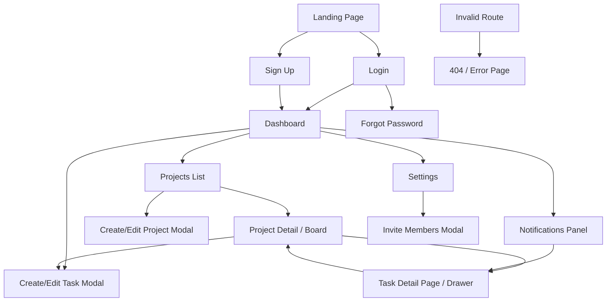

# PRD: Task Management Platform

## 1. Executive Summary
The Task Management Platform is a web application that helps individuals and small teams create, organize, assign, and track tasks in one place. It is designed for users who need lightweight project coordination without the complexity of enterprise project management tools. The product solves common issues around unclear ownership, missed deadlines, and scattered task updates by providing structured task workflows, team collaboration, and visibility through dashboards and task boards.

## 2. Problem & Solution
| Pain Point | Solution |
|-----------|----------|
| Tasks are tracked in chat, spreadsheets, or memory, causing missed work | Centralized task creation, assignment, due dates, and status tracking |
| Team members lack visibility into who owns what | Shared workspace with task assignees, project grouping, and status views |
| Managers cannot quickly understand progress or blockers | Dashboard and project board with filters, counts, and overdue indicators |
| Important task details and comments get lost | Task detail page with description, comments, activity history, and attachments metadata |

## 3. Goals & Non-Goals
### Goals (v1.0)
- Enable users to register, log in, and manage their personal account securely.
- Allow users to create projects and manage tasks within projects.
- Support task assignment, due dates, status changes, priority levels, and comments.
- Provide dashboard and board/list views to monitor task progress.
- Support basic team collaboration with workspace members and role-based access (member/admin).

### Non-Goals
- Advanced Gantt charts or resource planning.
- Time tracking, invoicing, or payroll.
- Native mobile apps.
- Deep third-party integrations (Slack, Jira, Google Calendar) in v1.0.
- Complex workflow automation or custom rule engines.

## 4. Feature Requirements

### Authentication & Account
- **FR-AU01 (P0)**: Users can sign up with name, email, and password.
- **FR-AU02 (P0)**: Users can log in with email and password.
- **FR-AU03 (P0)**: Users can log out from any authenticated page.
- **FR-AU04 (P1)**: Users can request password reset via email.
- **FR-AU05 (P1)**: Users can update profile information including display name and avatar.
- **FR-AU06 (P1)**: Users can change their password from settings.

### Workspace & Member Management
- **FR-WS01 (P0)**: Authenticated users can create a workspace.
- **FR-WS02 (P0)**: Workspace admins can invite members by email.
- **FR-WS03 (P1)**: Workspace admins can change member roles between admin and member.
- **FR-WS04 (P1)**: Workspace admins can remove members from the workspace.
- **FR-WS05 (P0)**: Users can switch between workspaces they belong to.

### Project Management
- **FR-PR01 (P0)**: Users can create, edit, archive, and view projects within a workspace.
- **FR-PR02 (P0)**: Each project includes name, description, color, and status.
- **FR-PR03 (P1)**: Users can view projects in a project list page with search and filter.
- **FR-PR04 (P1)**: Archived projects are hidden from default views but accessible from filters.

### Task Management
- **FR-TA01 (P0)**: Users can create tasks within a project.
- **FR-TA02 (P0)**: Each task supports title, description, assignee, due date, priority, status, and labels.
- **FR-TA03 (P0)**: Users can edit task details.
- **FR-TA04 (P0)**: Users can move tasks across statuses on a board view.
- **FR-TA05 (P0)**: Users can view tasks in both board and list formats.
- **FR-TA06 (P0)**: Users can filter tasks by assignee, status, priority, and due date.
- **FR-TA07 (P1)**: Users can archive or delete tasks.
- **FR-TA08 (P1)**: Users can add comments to tasks.
- **FR-TA09 (P1)**: The system stores task activity history for key changes.

### Dashboard & Notifications
- **FR-DA01 (P0)**: Users can view a dashboard summarizing assigned, overdue, and completed tasks.
- **FR-DA02 (P1)**: Users can see recent activity across projects in their workspace.
- **FR-DA03 (P1)**: Users receive in-app notifications for task assignment and mention events.

### Settings & Administration
- **FR-SE01 (P1)**: Users can manage personal settings.
- **FR-SE02 (P1)**: Workspace admins can manage workspace settings including name and logo.
- **FR-SE03 (P2)**: Users can configure simple notification preferences.

## 5. Pages & Screens

### 5.1 Landing Page
- **URL / Route**: `/`
- **Access**: public
- **Purpose**: Introduce the platform and drive sign-up or login.
- **Layout**: Top navigation, hero section, feature highlights, CTA banner, footer.
- **Key Elements**:
  - Hero headline and subtext: centered in top content area, visible by default
  - “Start Free” CTA button: prominent in hero, primary state
  - “Login” button: top-right nav, secondary state
  - Feature cards: mid-page grid
- **Interactions**:

  | Trigger | Action | Result / Feedback |
  |---------|--------|-------------------|
  | Click “Start Free” | Navigate to sign-up | Sign-up page loads |
  | Click “Login” | Navigate to login | Login page loads |
  | Click footer links | Open static info pages or contact email | New page/tab opens |

- **States**: loading skeleton on slow load; success default marketing content; error generic load failure message if content fails.
- **Layout regions**:
  - Top navigation
  - Hero section
  - Features section
  - CTA banner
  - Footer
- **On-screen inventory**:
  - Logo
  - Navigation links
  - Login button
  - Start Free button
  - Hero headline
  - Hero subheadline
  - Feature cards
  - CTA banner
  - Footer links

### 5.2 Sign Up Page
- **URL / Route**: `/signup`
- **Access**: public
- **Purpose**: Allow new users to create an account.
- **Layout**: Centered form card over simple branded background.
- **Key Elements**:
  - Name input
  - Email input
  - Password input
  - Confirm password input
  - Submit button
  - Link to login
- **Interactions**:

  | Trigger | Action | Result / Feedback |
  |---------|--------|-------------------|
  | Type in field | Update form state | Inline validation state changes |
  | Click “Create Account” | Validate and submit | Success toast + redirect to workspace setup or dashboard |
  | Click “Log in” | Navigate to login page | Login page loads |

- **States**: loading while submitting; error inline field errors/server message; success redirect after account creation; empty initial form.
- **Layout regions**:
  - Page background
  - Center form card
- **On-screen inventory**:
  - Brand logo
  - Form title
  - Name input
  - Email input
  - Password input
  - Confirm password input
  - Create Account button
  - Login link

### 5.3 Login Page
- **URL / Route**: `/login`
- **Access**: public
- **Purpose**: Authenticate an existing user.
- **Layout**: Centered login card.
- **Key Elements**:
  - Email input
  - Password input
  - Login button
  - Forgot password link
  - Sign-up link
- **Interactions**:

  | Trigger | Action | Result / Feedback |
  |---------|--------|-------------------|
  | Click “Login” | Validate credentials, POST to API | Redirect to dashboard on success; inline error on failure |
  | Click “Forgot password” | Navigate to reset request page | Reset page loads |
  | Click “Sign up” | Navigate to sign-up | Sign-up page loads |

- **States**: empty; loading submit spinner; invalid credentials error; success redirect.
- **Layout regions**:
  - Center login card
- **On-screen inventory**:
  - Logo
  - Email input
  - Password input
  - Login button
  - Forgot password link
  - Sign-up link

### 5.4 Forgot Password Page
- **URL / Route**: `/forgot-password`
- **Access**: public
- **Purpose**: Let users request a password reset email.
- **Layout**: Simple centered card with single form.
- **Key Elements**:
  - Email input
  - Send reset link button
  - Back to login link
- **Interactions**:

  | Trigger | Action | Result / Feedback |
  |---------|--------|-------------------|
  | Click “Send reset link” | Validate and submit email | Success message shown if accepted |
  | Click “Back to login” | Navigate to login | Login page loads |

- **States**: empty; loading; success confirmation; error inline validation/server error.
- **Layout regions**:
  - Center form card
- **On-screen inventory**:
  - Page title
  - Email input
  - Send reset link button
  - Back to login link

### 5.5 Dashboard
- **URL / Route**: `/dashboard`
- **Access**: authenticated
- **Purpose**: Provide an overview of task status and recent activity.
- **Layout**: App header, left sidebar, main summary area, right optional activity panel on desktop.
- **Key Elements**:
  - Workspace switcher in header
  - Sidebar navigation
  - Summary cards: Assigned to me, Overdue, Due today, Completed
  - Recent activity feed
  - “Create Task” quick action
- **Interactions**:

  | Trigger | Action | Result / Feedback |
  |---------|--------|-------------------|
  | Click summary card | Apply task filter and navigate to task list/board | Filtered results displayed |
  | Click “Create Task” | Open create task modal | Modal opens |
  | Switch workspace | Load selected workspace data | Dashboard refreshes with spinner |
  | Click recent activity item | Open related task/project detail | Target page opens |

- **States**: loading dashboard data; empty no tasks/activity state; error retry panel; success populated overview.
- **Layout regions**:
  - App header
  - Left sidebar
  - Main summary cards
  - Activity section
- **On-screen inventory**:
  - Logo
  - Workspace switcher
  - Global search placeholder or disabled field
  - Notification icon
  - User menu
  - Sidebar nav links
  - Summary cards
  - Recent activity list
  - Create Task button

### 5.6 Projects List Page
- **URL / Route**: `/projects`
- **Access**: authenticated
- **Purpose**: Show all projects in the current workspace.
- **Layout**: Header, sidebar, toolbar, project table/grid, create project button.
- **Key Elements**:
  - Search bar
  - Status filter
  - Project cards or rows
  - Create project button
- **Interactions**:

  | Trigger | Action | Result / Feedback |
  |---------|--------|-------------------|
  | Enter search | Filter projects list | Matching projects shown |
  | Change filter | Reload/filter dataset | List updates |
  | Click project row/card | Open project detail | Project page loads |
  | Click “Create Project” | Open modal | Create project modal opens |

- **States**: loading; empty no projects state with CTA; error with retry; success list/grid.
- **Layout regions**:
  - App header
  - Left sidebar
  - Toolbar
  - Project list/grid
- **On-screen inventory**:
  - Search input
  - Filter dropdown
  - Create Project button
  - Project cards/rows
  - Archive indicator badges

### 5.7 Project Detail / Board Page
- **URL / Route**: `/projects/:id`
- **Access**: authenticated
- **Purpose**: Manage tasks inside a specific project.
- **Layout**: Header, sidebar, project header, tab switcher for Board/List, filter bar, task content area.
- **Key Elements**:
  - Project title and metadata
  - Board/List toggle
  - Filters for assignee, priority, status, due date
  - Kanban columns
  - Add task button
- **Interactions**:

  | Trigger | Action | Result / Feedback |
  |---------|--------|-------------------|
  | Drag task card to another column | Update task status | Card moves; success toast or inline save indicator |
  | Click Board/List toggle | Switch view | Selected view renders |
  | Click task card | Open task detail drawer/page | Task detail opens |
  | Click “Add Task” | Open create task modal | Modal opens |
  | Change filter | Re-query/filter tasks | Visible tasks update |

- **States**: loading tasks; empty project state; empty filtered state; error loading project/tasks; success board/list.
- **Layout regions**:
  - App header
  - Left sidebar
  - Project header
  - View toggle and filters
  - Task board/list
- **On-screen inventory**:
  - Project name
  - Project description
  - Edit project button
  - Board/List tabs
  - Assignee filter
  - Priority filter
  - Status filter
  - Due date filter
  - Add Task button
  - Kanban columns
  - Task cards or list rows

### 5.8 Task Detail Page / Drawer
- **URL / Route**: `/tasks/:id` or drawer overlay from project page
- **Access**: authenticated
- **Purpose**: Show full task details and enable edits/comments.
- **Layout**: Main content with task fields on left and activity/comments panel below or right.
- **Key Elements**:
  - Task title editable field
  - Description editor
  - Assignee selector
  - Status dropdown
  - Priority dropdown
  - Due date picker
  - Labels
  - Comment thread
  - Activity log
- **Interactions**:

  | Trigger | Action | Result / Feedback |
  |---------|--------|-------------------|
  | Edit field and blur/save | PATCH task | Saved indicator shown |
  | Click status dropdown | Select new status | UI updates and persists |
  | Submit comment | POST comment | Comment appended to thread |
  | Click delete/archive | Confirm action | Task removed/archived on success |

- **States**: loading detail skeleton; error message with back action; success with editable data; empty comments/activity sections.
- **Layout regions**:
  - Header with title/actions
  - Task metadata form
  - Description section
  - Comments section
  - Activity history
- **On-screen inventory**:
  - Back button or close icon
  - Task title
  - Edit controls
  - Assignee dropdown
  - Status dropdown
  - Priority dropdown
  - Due date picker
  - Labels display/input
  - Description editor
  - Comment list
  - Comment input
  - Activity log
  - Archive button
  - Delete button

### 5.9 Settings Page
- **URL / Route**: `/settings`
- **Access**: authenticated
- **Purpose**: Let users manage profile and workspace settings.
- **Layout**: Header, sidebar, settings tabs, form panels.
- **Key Elements**:
  - Profile tab
  - Security tab
  - Workspace tab (admin only)
  - Notification preferences tab
- **Interactions**:

  | Trigger | Action | Result / Feedback |
  |---------|--------|-------------------|
  | Update profile fields | Save profile | Success toast |
  | Change password | Validate and submit | Password updated confirmation |
  | Edit workspace settings | Save workspace changes | Updated settings shown |
  | Toggle notifications | Save preferences | Toggle persists |

- **States**: loading settings; success; validation errors; unauthorized message for admin-only area.
- **Layout regions**:
  - App header
  - Left sidebar
  - Settings tab nav
  - Settings form panel
- **On-screen inventory**:
  - Tab menu
  - Name field
  - Avatar upload control
  - Email display
  - Password fields
  - Workspace name field
  - Workspace logo upload
  - Notification toggles
  - Save buttons

### 5.10 Invite Members Modal
- **URL / Route**: modal from dashboard/settings
- **Access**: authenticated admin-only
- **Purpose**: Invite workspace members by email.
- **Layout**: Center modal with form and action buttons.
- **Key Elements**:
  - Email input
  - Role selector
  - Send invite button
  - Cancel button
- **Interactions**:

  | Trigger | Action | Result / Feedback |
  |---------|--------|-------------------|
  | Submit invite | Validate and send invite | Success toast and modal close |
  | Cancel | Close modal | Return to previous page |

- **States**: empty; loading submit; success close; duplicate/invalid email error.
- **Layout regions**:
  - Modal header
  - Form body
  - Modal footer
- **On-screen inventory**:
  - Modal title
  - Email input
  - Role dropdown
  - Send Invite button
  - Cancel button

### 5.11 Create/Edit Project Modal
- **URL / Route**: modal from `/projects`
- **Access**: authenticated
- **Purpose**: Create or update a project.
- **Layout**: Center modal form.
- **Key Elements**:
  - Project name
  - Description
  - Color picker
  - Status selector
  - Save button
- **Interactions**:

  | Trigger | Action | Result / Feedback |
  |---------|--------|-------------------|
  | Submit form | Validate and save | Project appears/updates in list |
  | Cancel | Close modal | No changes saved |

- **States**: empty/create; populated/edit; loading save; validation error.
- **Layout regions**:
  - Modal header
  - Form body
  - Footer actions
- **On-screen inventory**:
  - Modal title
  - Name input
  - Description textarea
  - Color picker
  - Status dropdown
  - Save button
  - Cancel button

### 5.12 Create/Edit Task Modal
- **URL / Route**: modal from dashboard/project pages
- **Access**: authenticated
- **Purpose**: Create or edit a task quickly.
- **Layout**: Center modal with compact task form.
- **Key Elements**:
  - Title input
  - Description textarea
  - Project selector
  - Assignee selector
  - Status selector
  - Priority selector
  - Due date picker
  - Labels input
- **Interactions**:

  | Trigger | Action | Result / Feedback |
  |---------|--------|-------------------|
  | Submit form | Validate and create/update task | Success toast; modal closes; task list refreshes |
  | Cancel | Close modal | Form discarded |

- **States**: empty create; populated edit; loading save; validation errors.
- **Layout regions**:
  - Modal header
  - Form body
  - Footer actions
- **On-screen inventory**:
  - Title input
  - Description field
  - Project dropdown
  - Assignee dropdown
  - Status dropdown
  - Priority dropdown
  - Due date picker
  - Labels input
  - Save button
  - Cancel button

### 5.13 Notifications Panel
- **URL / Route**: overlay from header bell icon
- **Access**: authenticated
- **Purpose**: Display recent in-app notifications.
- **Layout**: Right-side panel or dropdown list.
- **Key Elements**:
  - Notification items
  - Mark all as read
  - Empty state
- **Interactions**:

  | Trigger | Action | Result / Feedback |
  |---------|--------|-------------------|
  | Click notification | Navigate to related task/project | Destination opens |
  | Click “Mark all as read” | Update notification states | Unread badges clear |

- **States**: loading; empty; success list; error with retry.
- **Layout regions**:
  - Panel header
  - Notification list
  - Panel footer
- **On-screen inventory**:
  - Panel title
  - Mark all as read button
  - Notification rows
  - Timestamps

### 5.14 404 / Error Page
- **URL / Route**: `/404` and fallback
- **Access**: public/authenticated
- **Purpose**: Handle invalid routes or unavailable content.
- **Layout**: Centered message with navigation actions.
- **Key Elements**:
  - Error illustration
  - Message text
  - Go home button
  - Back button
- **Interactions**:

  | Trigger | Action | Result / Feedback |
  |---------|--------|-------------------|
  | Click “Go home” | Navigate to landing or dashboard based on auth state | Appropriate home page loads |
  | Click “Back” | Browser back | Previous page opens |

- **States**: static error state only.
- **Layout regions**:
  - Center content block
- **On-screen inventory**:
  - Illustration
  - Error title
  - Error description
  - Go home button
  - Back button

## 5.3 Interaction overview (Mermaid diagram)

## 5.4 Interactive components index

| ID | Page | Component | Type | User interaction | Effect (feedback + outcome) |
|----|------|-----------|------|------------------|-----------------------------|
| IC-01 | Landing | Start Free | Button | Click | Navigates to sign-up |
| IC-02 | Landing | Login | Button | Click | Navigates to login |
| IC-03 | Sign Up | Create Account | Submit button | Click | Validates, creates account, redirects |
| IC-04 | Login | Login | Submit button | Click | Authenticates and redirects or shows error |
| IC-05 | Login | Forgot password | Link | Click | Opens forgot password page |
| IC-06 | Forgot Password | Send reset link | Submit button | Click | Sends reset request and shows confirmation |
| IC-07 | Dashboard | Workspace switcher | Dropdown | Select | Reloads workspace context |
| IC-08 | Dashboard | Create Task | Button | Click | Opens task modal |
| IC-09 | Dashboard | Summary cards | Clickable cards | Click | Opens filtered task view |
| IC-10 | Dashboard | Notification icon | Icon button | Click | Opens notifications panel |
| IC-11 | Projects | Search bar | Input | Type | Filters projects |
| IC-12 | Projects | Create Project | Button | Click | Opens project modal |
| IC-13 | Projects | Project row/card | Row/card | Click | Opens project detail |
| IC-14 | Project Detail | Board/List toggle | Tab switch | Click | Changes task view |
| IC-15 | Project Detail | Filter controls | Dropdown/date inputs | Change | Filters visible tasks |
| IC-16 | Project Detail | Add Task | Button | Click | Opens task modal |
| IC-17 | Project Detail | Task card | Card | Click/drag | Opens detail or changes status |
| IC-18 | Task Detail | Editable fields | Form controls | Edit/save | Persists changes |
| IC-19 | Task Detail | Comment input | Text input + button | Submit | Adds comment to thread |
| IC-20 | Task Detail | Archive/Delete | Button | Click | Confirms and removes/archives task |
| IC-21 | Settings | Tabs | Tab nav | Click | Switches settings section |
| IC-22 | Settings | Save buttons | Button | Click | Saves current settings |
| IC-23 | Settings | Invite members | Button | Click | Opens invite modal |
| IC-24 | Invite Modal | Send Invite | Submit button | Click | Sends invite and closes on success |
| IC-25 | Project Modal | Save | Submit button | Click | Creates/updates project |
| IC-26 | Task Modal | Save | Submit button | Click | Creates/updates task |
| IC-27 | Notifications Panel | Notification item | List item | Click | Opens related record |
| IC-28 | Notifications Panel | Mark all as read | Button | Click | Clears unread state |
| IC-29 | Error Page | Go home | Button | Click | Returns to appropriate home |
| IC-30 | Error Page | Back | Button | Click | Returns to previous page |

## 6. Key User Stories
| ID | As a... | I want to... | So that... |
|----|---------|-------------|-----------|
| US-01 | new user | create an account and log in | I can access my workspace securely |
| US-02 | workspace admin | create a project and invite team members | my team can collaborate in one place |
| US-03 | team member | create and update tasks with assignees and due dates | work is clearly tracked |
| US-04 | team member | move tasks across statuses on a board | I can reflect progress quickly |
| US-05 | manager | view dashboard summaries and overdue tasks | I can monitor team execution |
| US-06 | team member | comment on a task and review activity history | context and updates are preserved |

## 7. Acceptance Criteria

| ID | Feature / Story Ref | Criterion | How to Verify |
|----|---------------------|-----------|---------------|
| AC-01 | FR-AU01 | User can create an account with valid name, unique email, and password meeting minimum length requirement | Manual sign-up test |
| AC-02 | FR-AU02 | Valid credentials redirect the user to `/dashboard` within 2 seconds of successful API response | Manual and automated integration test |
| AC-03 | FR-WS02 | Admin can submit an email invite and the invited email appears in pending invites list or receives success confirmation | Manual admin workflow test |
| AC-04 | FR-PR01 | Authenticated user can create a project with required name and view it in `/projects` immediately after save | Manual CRUD test |
| AC-05 | FR-TA01 | User can create a task linked to a selected project and see it appear in the project view after modal close | Manual CRUD test |
| AC-06 | FR-TA04 | Dragging a task card to a new board column updates its stored status and persists after page refresh | Manual DnD test + API verification |
| AC-07 | FR-TA06 | Applying assignee and status filters only displays tasks matching all selected filters | Manual filter test |
| AC-08 | FR-TA08 | Submitting a non-empty comment appends it to the task comment list with author name and timestamp | Manual task detail test |
| AC-09 | FR-DA01 | Dashboard displays counts for Assigned to me, Overdue, Due today, and Completed using current workspace data | Manual data validation |
| AC-10 | FR-SE02 | Workspace admin can update workspace name and see the new name in the header after refresh | Manual settings test |
| AC-11 | US-01 | Unauthenticated users attempting to access authenticated routes are redirected to `/login` | Automated route guard test |
| AC-12 | US-02 | Invited members who accept an invite can access the workspace and view shared projects according to role | End-to-end invite test |
| AC-13 | US-03 | Editing task title, assignee, due date, or priority saves successfully and shows updated values on reopen | Manual edit test |
| AC-14 | US-04 | Moving a task from “To Do” to “Done” changes its status badge consistently in both board and list views | Manual cross-view consistency test |
| AC-15 | US-05 | Clicking the Overdue summary card shows only tasks with due dates earlier than today and not marked Done | Manual dashboard drill-down test |
| AC-16 | US-06 | Activity log records task status changes and comments in reverse chronological order | Manual activity audit test |

## 8. Technical Requirements
| Category | Requirement |
|----------|------------|
| Performance | Primary pages should load initial visible content within 3 seconds on standard broadband for typical workspace sizes |
| Security | Passwords must be hashed; authenticated APIs must require secure session or token validation |
| Authorization | Workspace data must be scoped so users only access workspaces, projects, and tasks they belong to |
| Reliability | Failed API calls should show clear retryable error messages without page crashes |
| Browser Support | Support latest two versions of Chrome, Safari, Edge, and Firefox |
| Accessibility | Forms and key navigation flows must support keyboard navigation and basic screen reader labels |

## 9. Data Model Overview
- **User**: account holder with profile data, authentication credentials, and notification preferences.
- **Workspace**: top-level collaboration container owned by one or more admins; contains members, projects, and notifications.
- **WorkspaceMember**: join entity linking users to workspaces with role metadata such as admin or member.
- **Project**: belongs to a workspace; contains descriptive metadata and a collection of tasks.
- **Task**: belongs to a project and workspace; includes title, description, assignee, creator, status, priority, due date, labels, and archive state.
- **Comment**: belongs to a task and user; stores comment body and timestamp.
- **ActivityLog**: belongs to a task or project context; records key actions such as creation, status changes, reassignment, and comments.
- **Notification**: belongs to a user in a workspace; references task or project events and stores read/unread status.
- **Invite**: belongs to a workspace; stores invited email, role, inviter, status, and expiration.

Relationship summary:
- A **User** can belong to many **Workspaces** through **WorkspaceMember**.
- A **Workspace** has many **Projects**, **Members**, **Invites**, and **Notifications**.
- A **Project** has many **Tasks**.
- A **Task** can have one assignee, many **Comments**, and many **ActivityLog** entries.
- **Notifications** are generated from task assignment and mention-related events.