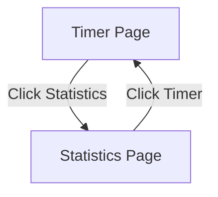

# PRD: Pomodoro Timer with Statistics

## 1. Executive Summary
The Pomodoro Timer application is a productivity tool designed to help users manage their work sessions using the Pomodoro Technique. It targets individuals looking to enhance their focus and productivity by alternating work and break intervals. The application includes a statistics dashboard to track time spent, without requiring user authentication.

## 2. Problem & Solution
| Pain Point | Solution |
|-----------|----------|
| Users struggle with maintaining focus during work sessions | Implement a Pomodoro timer to structure work and break intervals |
| Users lack insights into their productivity patterns | Provide a statistics dashboard to track time usage and trends |
| Users need a simple tool without the hassle of logging in | Offer a fully functional application without requiring user authentication |

## 3. Goals & Non-Goals
### Goals (v1.0)
- Provide a Pomodoro timer with customizable work and break intervals
- Display a statistics dashboard to visualize time usage
- Ensure a simple, user-friendly interface without login requirements
- Allow users to reset their statistics if desired

### Non-Goals
- Implementing user authentication or profiles
- Advanced productivity analysis beyond basic statistics
- Integration with external calendars or task management tools

## 4. Feature Requirements
### Timer Module
- **FR-TM01**: Implement a Pomodoro timer with default work (25 min) and break (5 min) intervals (P0)
- **FR-TM02**: Allow users to customize the length of work and break intervals (P1)
- **FR-TM03**: Provide visual and audio notifications at the end of each interval (P0)

### Statistics Module
- **FR-SM01**: Display a dashboard showing total work and break time per day (P0)
- **FR-SM02**: Include charts to visualize weekly and monthly time usage trends (P1)
- **FR-SM03**: Allow users to reset their statistics (P2)

## 5. Pages & Screens

### 5.1 Timer Page
- **URL / Route**: `/timer`
- **Access**: public
- **Purpose**: Allows users to start, pause, and reset the Pomodoro timer
- **Layout**: Header with app title, main content with timer and controls, footer with navigation to statistics
- **Key Elements**:
  - Timer Display: Centered, shows countdown of current interval
  - Control Buttons: Start, Pause, Reset below the timer
- **Interactions**:
  | Trigger | Action | Result / Feedback |
  |---------|--------|-------------------|
  | Click "Start" | Start timer countdown | Timer begins, "Start" changes to "Pause" |
  | Click "Pause" | Pause timer | Timer stops, "Pause" changes to "Start" |
  | Click "Reset" | Reset timer | Timer resets to initial interval value |
- **States**: 
  - Loading: Initial state before timer starts
  - Running: Timer counting down
  - Paused: Timer stopped
  - Completed: Timer reaches zero, notification shown
- **Layout regions**:
  - Header
  - Main content (Timer Display, Control Buttons)
  - Footer
- **On-screen inventory**:
  - Timer Display
  - Start Button
  - Pause Button
  - Reset Button

### 5.2 Statistics Page
- **URL / Route**: `/statistics`
- **Access**: public
- **Purpose**: Show user statistics on time spent using the Pomodoro timer
- **Layout**: Header with app title, main content with charts and summary, footer with navigation to timer
- **Key Elements**:
  - Daily Summary: Total work and break time
  - Weekly/Monthly Charts: Visual trend representation
  - Reset Statistics Button: Option to clear all data
- **Interactions**:
  | Trigger | Action | Result / Feedback |
  |---------|--------|-------------------|
  | Click "Reset Statistics" | Confirm reset | All statistics data cleared, message displayed |
- **States**: 
  - Loading: Fetching statistics data
  - Data Available: Showing charts and summaries
  - No Data: Message indicating no statistics available
- **Layout regions**:
  - Header
  - Main content (Daily Summary, Charts, Reset Button)
  - Footer
- **On-screen inventory**:
  - Daily Summary Display
  - Weekly Chart
  - Monthly Chart
  - Reset Statistics Button

## 5.3 Interaction overview (Mermaid diagram)

## 5.4 Interactive components index

| ID | Page | Component | Type | User interaction | Effect (feedback + outcome) |
|----|------|-----------|------|------------------|-----------------------------|
| IC-01 | Timer Page | Start Button | Button | Click | Timer starts, button changes to "Pause" |
| IC-02 | Timer Page | Pause Button | Button | Click | Timer pauses, button changes to "Start" |
| IC-03 | Timer Page | Reset Button | Button | Click | Timer resets to default interval |
| IC-04 | Statistics Page | Reset Statistics Button | Button | Click | Statistics reset, confirmation message shown |

## 6. Key User Stories
| ID | As a... | I want to... | So that... |
|----|---------|-------------|-----------|
| US-01 | User | Start and stop a Pomodoro timer | I can manage my work sessions effectively |
| US-02 | User | Customize the timer intervals | They fit my personal workflow |
| US-03 | User | View my work and break time statistics | I can track my productivity trends |
| US-04 | User | Reset my statistics | I can clear old data and start fresh |

## 7. Acceptance Criteria

| ID | Feature / Story Ref | Criterion | How to Verify |
|----|---------------------|-----------|---------------|
| AC-01 | FR-TM01 | Timer starts counting down from 25 minutes | Manual test by clicking "Start" |
| AC-02 | US-01 | Timer can be paused and resumed | Manual test by clicking "Pause" and "Start" |
| AC-03 | FR-SM01 | Daily summary displays correct total time | Manual test with mock data |
| AC-04 | US-03 | Weekly chart shows correct trends | Manual test with mock data |

## 8. Technical Requirements
| Category | Requirement |
|----------|------------|
| Performance | Timer must update every second without lag |
| Security | No sensitive data stored; local storage for statistics |
| Browser Support | Should support latest versions of Chrome, Firefox, Safari |
| Accessibility | Ensure all controls are accessible via keyboard |

## 9. Data Model Overview
The application primarily uses a local storage model to save and retrieve user statistics:
- **PomodoroSession**: Tracks start time, end time, and type (work/break)
- **Statistics**: Aggregates session data into daily, weekly, and monthly summaries

## Rules
- Be proportional to the project scope. Don't over-engineer.
- Every feature gets a unique ID (FR-XX##).
- The Pages & Screens section is CRITICAL — list every distinct page with layout regions, on-screen inventory, interactions, and states.
- Do not skip **5.3 Mermaid** or **5.4 Interactive components index**.
- Acceptance Criteria must be specific, measurable, and binary pass/fail.
- PRD length: 1200–3000 words.
- Write in English; professional tone.