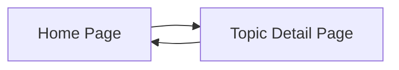

# PRD: Browser-Based Forum System

## 1. Overview
This is a lightweight, browser-based forum system designed for users who want to create and participate in discussions without the need for server-side storage. All data is temporarily stored in the user's browser, making it ideal for private or local discussions without persistent data.

## 2. Core Features
- **F-01**: Create New Topic — Users can create new discussion topics.
- **F-02**: Post Replies — Users can post replies to existing topics.
- **F-03**: View Topics — Users can view a list of all topics.
- **F-04**: View Replies — Users can view all replies to a specific topic.
- **F-05**: Edit/Delete Posts — Users can edit or delete their own posts.
- **F-06**: Local Data Storage — All data is stored in-browser using local storage.

## 3. Pages & Screens

### 3.1 Home Page
- **URL / Route**: `/`
- **Purpose**: Displays a list of discussion topics.
- **Layout regions**:
  - Header: Application title
  - Body: List of topics
  - Footer: Create new topic button
- **On-screen inventory**:
  - "Create New Topic" button
  - List of topics (each topic is a clickable item)
- **Key non-interactive elements**:
  - Static application title

### 3.2 Topic Detail Page
- **URL / Route**: `/topic/:id`
- **Purpose**: Shows all replies to a specific topic and allows posting new replies.
- **Layout regions**:
  - Header: Topic title
  - Body: List of replies
  - Footer: Reply input and submit button
- **On-screen inventory**:
  - "Reply" input field
  - "Submit Reply" button
  - List of replies (each with edit and delete options for the author)
- **Key non-interactive elements**:
  - Static topic title

## 4. Interactive components (required)

| ID | Page | Component | Type | User interaction | Effect (feedback + outcome) |
|----|------|-----------|------|------------------|-----------------------------|
| IC-01 | Home | Create New Topic | Button | Click | Opens dialog to enter topic details |
| IC-02 | Home | Topic Item | List item | Click | Navigates to Topic Detail Page |
| IC-03 | Topic Detail | Submit Reply | Button | Click | Adds reply to the list; clears input field |
| IC-04 | Topic Detail | Edit Post | Button | Click | Opens edit dialog for selected post |
| IC-05 | Topic Detail | Delete Post | Button | Click | Removes post from the list |

## 5. Interaction overview (Mermaid diagram)

## 6. User Flow

1. User navigates to the Home Page.
2. User clicks on "Create New Topic" (IC-01) to add a topic.
3. User selects a topic from the list (IC-02) to view details.
4. On the Topic Detail Page, user writes a reply and clicks "Submit Reply" (IC-03).
5. User can edit (IC-04) or delete (IC-05) their own posts.

## 7. Acceptance Criteria

| ID | Feature Ref | Criterion | How to Verify |
|----|------------|-----------|---------------|
| AC-01 | F-01 | User can create a new topic | Check that topic appears in the list |
| AC-02 | F-02 | User can post a reply to a topic | Verify reply is added to the topic's reply list |
| AC-03 | F-03 | User can view all topics | Ensure all created topics are listed |
| AC-04 | F-04 | User can view all replies to a topic | Check replies are displayed under the correct topic |
| AC-05 | F-05 | User can edit or delete their own posts | Confirm changes or deletions reflect immediately |
| AC-06 | F-06 | Data persists in browser until cleared | Verify data remains after page refresh |

## 8. Technical Constraints

- Supports latest versions of Chrome, Firefox, and Edge.
- Must handle up to 100 topics and 1000 replies efficiently.
- Basic accessibility must be ensured (e.g., keyboard navigation).
- Local storage is the only data persistence mechanism.