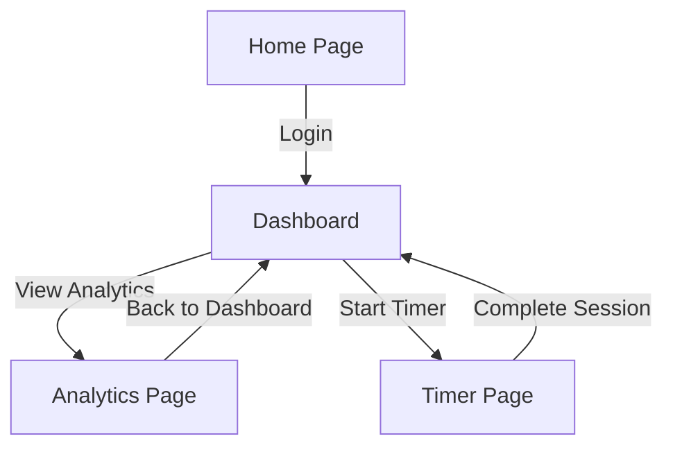

# PRD: Pomodoro Timer with Backend Data Analytics

## 1. Executive Summary
The Pomodoro Timer application offers users an effective time management tool based on the Pomodoro Technique, allowing them to track productivity sessions and breaks. It features backend data analytics to provide insights into user productivity patterns. The application targets individuals who seek to improve their focus and productivity by analyzing their time management habits.

## 2. Problem & Solution

| Pain Point | Solution |
|------------|----------|
| Users struggle with maintaining focus for extended periods | Implement a Pomodoro Timer to encourage short, focused work sessions followed by breaks |
| Lack of insight into personal productivity patterns | Provide backend analytics to track and visualize productivity data |
| Difficulty in managing work-life balance | Use structured breaks to prevent burnout and improve work-life balance |

## 3. Goals & Non-Goals

### Goals (v1.0)
- Develop a user-friendly Pomodoro Timer interface.
- Implement backend analytics to track user sessions and breaks.
- Provide visual reports on productivity patterns.
- Enable user account creation and data storage.
- Ensure cross-device synchronization of user data.

### Non-Goals
- Integration with third-party productivity tools.
- Advanced AI-driven productivity suggestions.
- Offline mode operation.

## 4. Feature Requirements

### Timer Module
- **FR-TM01**: Provide a timer for 25-minute work sessions and 5-minute breaks (P0).
- **FR-TM02**: Allow users to customize session and break lengths (P1).
- **FR-TM03**: Display countdown with start, pause, and reset controls (P0).

### Analytics Module
- **FR-AM01**: Track number of completed sessions and breaks (P0).
- **FR-AM02**: Generate weekly and monthly productivity reports (P1).
- **FR-AM03**: Visualize data with charts and graphs (P1).

### User Account Module
- **FR-UA01**: Enable user registration and login (P0).
- **FR-UA02**: Store user data securely in the backend (P0).
- **FR-UA03**: Synchronize user data across devices (P1).

## 5. Pages & Screens

### 5.1 Home Page
- **URL / Route**: `/home`
- **Access**: public
- **Purpose**: Introduce the Pomodoro Timer and provide a login prompt.
- **Layout**: Header with navigation, main content with timer overview, footer with contact links.
- **Key Elements**:
  - Timer Overview: Central, displays current timer status.
  - Login Button: Top-right, prompts login modal.
- **Interactions**:
  | Trigger | Action | Result / Feedback |
  |---------|--------|-------------------|
  | Click "Login" | Open login modal | Modal displayed for user authentication |
  | Click "Start Timer" | Start countdown | Timer begins countdown, button changes to "Pause" |
- **States**: 
  - Loading: Spinner while fetching user data.
  - Error: Notification if data fetch fails.
  - Success: Timer and user data displayed.
- **Layout regions**: Header, Main Content, Footer.
- **On-screen inventory**: Timer Display, Start/Pause Button, Login Button, Navigation Links.

### 5.2 Dashboard
- **URL / Route**: `/dashboard`
- **Access**: authenticated
- **Purpose**: Display user productivity analytics.
- **Layout**: Sidebar for navigation, main content with analytics overview, header with user info.
- **Key Elements**:
  - Productivity Graph: Center, shows session data.
  - Session History: Below graph, lists past sessions.
- **Interactions**:
  | Trigger | Action | Result / Feedback |
  |---------|--------|-------------------|
  | Click "View Details" | Expand session data | Detailed session information displayed |
  | Hover on graph | Highlight data point | Tooltip shows exact data value |
- **States**: 
  - Empty: Message indicating no data if user is new.
  - Error: Alert if analytics data fails to load.
- **Layout regions**: Header, Sidebar, Main Content.
- **On-screen inventory**: Productivity Graph, Session History, Navigation Menu.

### 5.3 Interaction overview (Mermaid diagram)

## 5.4 Interactive components index

| ID  | Page      | Component       | Type     | User interaction   | Effect (feedback + outcome)              |
|-----|-----------|-----------------|----------|--------------------|------------------------------------------|
| IC-01 | Home      | Login Button    | Button   | Click              | Opens login modal                        |
| IC-02 | Home      | Start Timer     | Button   | Click              | Starts timer countdown                   |
| IC-03 | Dashboard | View Details    | Button   | Click              | Expands session details                  |
| IC-04 | Dashboard | Productivity Graph | Graph | Hover              | Displays tooltip with data value         |

## 6. Key User Stories

| ID   | As a...      | I want to...                          | So that...                                |
|------|--------------|---------------------------------------|-------------------------------------------|
| US-01 | User         | Start a Pomodoro session             | I can focus on my work for a fixed period |
| US-02 | User         | View my productivity data            | I can understand my focus patterns        |
| US-03 | User         | Customize my session lengths         | I can adjust to my personal work style    |
| US-04 | User         | Register and log in                  | My data is saved and synchronized         |
| US-05 | User         | Receive notifications for breaks     | I don't overwork and can take necessary breaks |
| US-06 | User         | Access my data from any device       | I can maintain continuity in my work      |

## 7. Acceptance Criteria

| ID   | Feature / Story Ref | Criterion                                      | How to Verify                              |
|------|---------------------|------------------------------------------------|--------------------------------------------|
| AC-01 | FR-TM01             | Timer starts and stops correctly               | Manual test: Start and stop timer          |
| AC-02 | FR-AM01             | Session data is accurately recorded            | Automated check: Verify database entries   |
| AC-03 | US-01               | User can start a session                       | Manual test: Start session button          |
| AC-04 | US-02               | User sees correct analytics visualization      | Manual test: Check graphs on dashboard     |
| AC-05 | FR-UA01             | User can register and log in successfully      | Manual test: Register and log in process   |
| AC-06 | FR-TM02             | Users can set custom session lengths           | Manual test: Adjust settings and verify    |

## 8. Technical Requirements

| Category  | Requirement                                      |
|-----------|--------------------------------------------------|
| Performance | Support for up to 10,000 concurrent users      |
| Security   | Data encryption for all user data               |
| Browser Support | Compatible with latest Chrome, Firefox, Safari |
| Scalability | Backend should support horizontal scaling      |
| Data Privacy | Compliance with GDPR for user data handling   |

## 9. Data Model Overview

The application will feature entities such as User, Session, and Analytics. Users have many Sessions, each consisting of a start time, end time, and type (work/break). Analytics are derived from aggregating session data, providing insights on productivity over time. Relationships are primarily one-to-many between Users and Sessions, and Sessions feed into Analytics for reporting purposes.